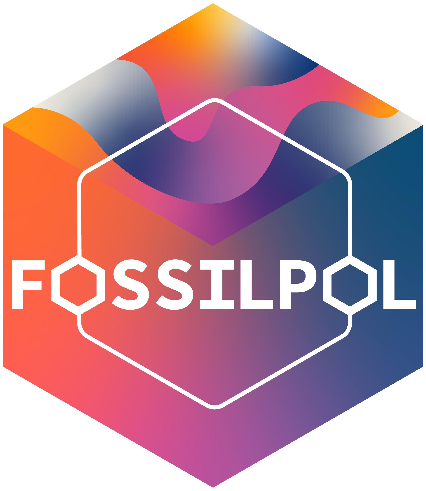

```{r}
#| label: setup
#| include: false
options(htmltools.dir.version = FALSE)
knitr::opts_chunk$set(
  fig.align = "center",
  out.width = "100%",
  dpi = 300,
  fig.align = "center"
)

if (!require("here")) install.packages("here")
library(here)
here::i_am("Presentation/presentation.qmd")

if (!require("renv")) install.packages("renv")
library(renv)
renv::restore(
  lockfile = here::here("renv.lock"),
  prompt = FALSE
)

if (!require("countdown")) install.packages("countdown")
library(countdown)


if (!require("jsonlite")) install.packages("jsonlite")
library(jsonlite)

if (!require("tidyverse")) install.packages("tidyverse")
library(tidyverse)

if (!require("qrcode")) install.packages("qrcode")
library(qrcode)

if (!require("cropcircles")) install.packages("cropcircles")
library(cropcircles)

include_local_figure <- function(data_source) {
  knitr::include_graphics(
    path = here::here(
      "Presentation",
      "Materials",
      data_source
    ),
    error = TRUE
  )
}


source(
  here::here("R/___setup_project___.R")
)

# Dynamic project name generation using {here}
project_name <- 
  basename(here::here())


# Create dynamic URLs
github_url <- 
  paste0(
    "https://github.com/OndrejMottl/",
     project_name
  )

slides_url <- 
  paste0(
    "https://ondrejmottl.github.io/", 
    project_name, "/"
  )
```

# {.bg-black}

<br>

:::: {.columns}

::: {.column width="70%"}
:::

::: {.column width="10%"}

```{r}
#| label: loqe-logo-title
include_local_figure("Logos/LoQE_logo_with_text_white_bg.png")
```

:::

::: {.column width="10%"}

```{r}
#| label: NATUC-logo-title
include_local_figure("Logos/PrFUK_strom_digital_bila.png")
```

:::

::: {.column width="10%"}

```{r}
#| label: UK-logo-title
include_local_figure("Logos/PR-56-version1-uk_slavnostni_eng_bila_hd.png")
```

:::


::::

<br>

:::: {.r-hstack}
::: {data-id="box1" style="background: `r colours['blue']`; width: 135px; height: 15px; margin: 0px;"}
:::

::: {data-id="box2" style="background: `r colours['white']`; width: 405px; height: 15px; margin: 0px;"}
:::

::: {data-id="box3" style="background: `r colours['pink']`; width: 135px; height: 15px; margin: 0px;"}
:::

::: {data-id="box4" style="background: `r colours['coral']`; width: 225px; height: 15px; margin: 0px;"}
:::

::: {data-id="box5" style="background: `r colours['orange']`; width: 135px; height: 15px; margin: 0px;"}
:::

::::

<br>

::: {.text-color-white .text-font-heading .text-size-heading3 .text-bold .text-center}
Estimating [Vegetation Change]{.text-highlight-blue .text-shadow-dark} from [Fossil Pollen]{.text-highlight-pink .text-shadow-dark} to [Planetary Boundaries]{.text-highlight-orange .text-shadow-light}
:::

::: {.text-color-white .text-font-heading .text-size-heading4 .text-center}
A Global, Long-Term Synthesis Using Big Data
:::

<br> 
<br> 

:::: {.columns}

::: {.column width="13%"}

```{r}
#| label: qr_presentation_title
qr_presentation <-
  qrcode::qr_code(
    slides_url,
    ecl = "H"
  )

qrcode::generate_svg(
  qrcode = qr_presentation,
  filename = here::here("Presentation/Materials/QR/qr_presentation.svg"),
  foreground = colours[["white"]],
  background = colours[["black"]],
  show = FALSE
)

include_local_figure("QR/qr_presentation.svg")
```
:::


::: {.column width="87%" .text-right .text-size-body .text-color-grey}
[👤](https://ondrejmottl.github.io/)Ondřej Mottl

[TIBS 2026]{.text-color-grey}
:::

::::


::: {.footer}
Scan the QR code to follow along!
:::

## {.bg-black}

:::: {.columns}

::: {.column width="50%"}

<br>
<br>

```{r}
#| label: earth image
include_local_figure("AI_generated/Earth.jpeg")
```

:::

::: {.column width="50%" .text-center .center-vertical}

6/9 [global]{.text-highlight-purple .text-shadow-dark} Earth [Planetary Boundaries]{.text-highlight-pink .text-shadow-dark} are already [exceeded]{.text-highlight-orange .text-shadow-light} 

::: {.text-smaller .text-color-grey}
(Richardson et al. [2023](https://doi.org/10.1126/sciadv.adh2458))
:::

:::

::::

::: {.footer}
Image generated by Bing
:::

## {background-image="../Presentation/Materials/Pexels/pexels-justus-menke-3490295-5214145.jpg" background-opacity="0.55" .text-center}

:::: {.columns}

::: {.column width="20%"}
:::

::: {.column width="60%"} 

::: {.r-fit-text .text-bold .text-color-blue .text-shadow-dark .text-underline}
~20%
:::

:::

::: {.column width="20%"}
:::

::::

::: {.blockquote}
Species to be exposed to [dangerous temperature]{.text-bold} condition (with global increase of 2.0°C) 

::: {.text-smaller .text-color-grey}
([IPCC AR6 Synthesis Report](https://www.ipcc.ch/report/ar6/syr/downloads/report/IPCC_AR6_SYR_SPM.pdf))
:::

:::

::: {.footer}
[Image by Justus Menke from Pexels]{.text-background-white}
:::

## 

:::: {.columns}

::: {.column width="50%"}
<br>
[🤔]{.r-fit-text}
:::

::: {.column width="50%" .text-center .text-larger .text-bold}

<br>
<br>
<br>


What if we inform the [conservation]{.text-highlight-blue .text-shadow-dark} policies by incorporating a [global]{.text-highlight-purple .text-shadow-dark}, [long-term]{.text-highlight-pink .text-shadow-dark} synthesis on ecosystem [dynamics]{.text-highlight-coral .text-shadow-dark} using [Big Data]{.text-highlight-orange .text-shadow-light}?
:::

::::

## 🙋[Hi!]{.text-highlight-blue .text-shadow-dark} I am [Ondřej Mottl]{.text-highlight-orange .text-shadow-light}

<br>

:::: {.columns}

::: {.column width="35%"}

```{r}
#| label: personal sticker
include_local_figure("About/head_photo.png")
```


:::

::: {.column width="1%"}

:::

::: {.column width="64%" .text-center}

<br>

Assistant Professor at 🏛️[Charles University](https://cuni.cz/UK-1.html), Prague, 🇨🇿

Head of the 🧑‍💻[Laboratory of Quantitative Ecology](https://ondrejmottl.github.io/lab/about_the_lab.html)

Interested in [macroecology]{.text-highlight-purple .text-shadow-dark}, [palaeoecology]{.text-highlight-pink .text-shadow-dark}, [biodiversity]{.text-highlight-coral .text-shadow-dark}, and [data science]{.text-highlight-orange .text-shadow-light}

:::

::::

:::: {.columns}

::: {.column width="5%"}
:::

::: {.column width="45%" .text-smaller}

* 📧 ondrej.mottl(at)gmail.com
* 🦋 [ondrejmottl.bsky.social](https://bsky.app/profile/ondrejmottl.bsky.social)
* 🐱 [Github](https://github.com/OndrejMottl)
* 🆔 [ORCID](https://orcid.org/0000-0002-9796-5081)
* 🌐 [Personal webpage](https://ondrejmottl.github.io/)
:::

::: {.column width="20%"}
```{r}
#| label: loqe-logo-about_me
include_local_figure("Logos/LoQE_logo_with_text_white_bg.png")
```

:::

::: {.column width="5%"}
:::

::: {.column width="20%"}

```{r}
#| label: QR code https://bit.ly/ondrej_mottl 
qr_personal_web <-
  qrcode::qr_code(
    "https://bit.ly/ondrej_mottl",
    ecl = "H"
  )

qrcode::generate_svg(
  qrcode = qr_personal_web,
  filename = here::here("Presentation/Materials/QR/qr_personal_web.svg"),
  foreground = colours[["black"]],
  background = colours[["white"]],
  show = FALSE
)

include_local_figure("QR/qr_personal_web.svg")
```

:::

::: {.column width="5%"}
:::

::::

# Palaeoecology

<br>

:::: {.columns}

::: {.column width="5%"}
:::

::: {.column width="40%"}

```{r}
#| label: fordham_2020_a
include_local_figure("Fordham/369_abc5654_fa.jpeg")
```

:::

::: {.column width="5%"}
:::


::: {.column width="50%"}

<br>

```{r}
#| label: fordham_2020_b
include_local_figure("Fordham/369_abc5654_f4.jpeg")
```
:::

::::

::: {.text-center .text-size-heading3 .text-font-heading}
Using [paleo-archives]{.text-highlight-blue .text-shadow-dark} to [safeguard]{.text-highlight-pink .text-shadow-dark} biodiversity 
:::

::: {.footer}
Fordham et al. ([2020](https://doi.org/10.1126/science.abc5654))
:::

## 

<br>
<br>

:::: {.columns}

::: {.column width = "50%" .text-size-heading3 .text-italic .text-center .text-font-heading}

<br>
<br>
<br>

[Fossil pollen]{.text-highlight-purple .text-bold .text-shadow-dark} as a window to the past [vegetation]{.text-highlight-orange .text-shadow-light} patterns
:::

::: {.column width = "50%"}

```{r}
#| label: palaeoecology
include_local_figure("Ai_generated/fossilpollen.jpeg")
```
:::

::::

::: {.footer}
Image created by Bing 
:::


## Neotoma Paleoecology Database {.text-center background-image="../Presentation/Materials/R_generated/Fossil_pollen/Neotoma_spatial_data_full-2025-12-09.png" background-size="1500px" background-repeat="no-repeat" background-opacity="0.65"}

{.absolute top=600 left=0 width="100" height="100"}
{.absolute top=600 right=0 width="100" height="100"}

<br>
<br>

:::: {.columns}

::: {.column width = "15%"}
:::

::: {.column width = "70%"}

::: {.text-bold .r-fit-text .text-color-black}
\>6650
:::

::: {.blockquote}
fossil pollen timeseries (records)
:::

:::

::: {.column width = "15%"}
:::

::::

::: {.footer}
Fossil pollen datasets accessed from Neotoma on 2025-12-09
:::


## Palaeoecological dataset compilation

<br>
<br>

:::: {.columns}

::: {.column width = "70%"}

```{r}
#| label: compilation_full
include_local_figure("FOSSILPOL/Visualisation-compilation/compilation_full.png")
```
:::

::: {.column width = "30%"}

<br>


- Macro-scale data analysis
- Project specific
- Data quality control and reproducibility

:::

::::

## {.bg-black .text-color-white}

:::: {.columns}

::: {.column width = "45%"}

<br>


```{r}
#| label: fossilpol_logo_2
include_local_figure("Logos/FOSSILPOL_logo_600ppi.png")
```

:::

::: {.column width = "55%" .center-vertical .text-larger .text-center .text-bold}
The workflow to process [global]{.text-highlight-blue .text-shadow-dark} palaeoecological data of [fossil pollen]{.text-highlight-purple .text-shadow-dark} for [vegetation]{.text-highlight-pink .text-shadow-dark}-based [macroecological]{.text-highlight-coral .text-shadow-dark} [synthesis]{.text-highlight-orange .text-shadow-light}
:::

::::

## [FOSSILPOL workflow]{.text-color-white .text-shadow-dark} {background-image="../Presentation/Materials/FOSSILPOL/Banners/Banner_5.png" background-size="100% 20%" background-position="top left" background-repeat="no-repeat"}

<br>

```{r}
#| label: workflow_full
#| out.height: 100%
#| out.width: NULL
include_local_figure("FOSSILPOL/Visualisation-workflow/workflow_full.png")
```

## Documentation (website)

<br>

:::: {.columns}

::: {.column width="30%"}

```{r}
#| label: website_preview
include_local_figure("Printscreens/website_preview.png")
```


```{r}
#| label: QR code https://bit.ly/FOSSILPOL 
qr_fossilpol <-
  qrcode::qr_code(
    "https://bit.ly/FOSSILPOL",
    ecl = "H"
  )

qrcode::generate_svg(
  qrcode = qr_fossilpol,
  filename = here::here("Presentation/Materials/QR/qr_fossilpol.svg"),
  foreground = colours[["black"]],
  background = colours[["white"]],
  show = FALSE
)

include_local_figure("QR/qr_fossilpol.svg")
```

:::

::: {.column width="5%"}
:::

::: {.column width="60%" .text-center}

<br>

```{r}
#| label: website_doc_preview
include_local_figure("Printscreens/website_doc_preview.png")
```

Now bilingual! ([English]{.text-highlight-purple .text-shadow-dark}/[Spanish]{.text-highlight-pink .text-shadow-dark})

[Check it out!]{.text-highlight-orange .text-bold .text-shadow-light} - [bit.ly/FOSSILPOL](https://bit.ly/FOSSILPOL)

:::

::::

## FOSSILPOL

{.absolute top=20 right=70 width="100" height="115"}

:::: {.columns}

::: {.column width="75%"}

<br>

- Open-source and fully [reproducible workflow]{.text-highlight-blue .text-shadow-dark} written in [R]{.text-highlight-purple .text-shadow-dark}
- Handles all the steps and [flags places]{.text-highlight-pink .text-shadow-dark}, where the user needs to [specify their choices]{.text-highlight-coral .text-shadow-dark}
- Modular structure to allow [flexibility]{.text-highlight-orange .text-shadow-light} and [customisation]{.text-highlight-green .text-shadow-dark} for different projects

:::

::: {.column width="25%"}

<br> 

```{r}
#| label: fossilpol_qr_2
include_local_figure("QR/qr_fossilpol.svg")
```

:::

::::

:::: {.columns .fragment}

::: {.column width="60%" .text-center}
*A guide to the processing and standardisation of global palaeoecological data for large-scale syntheses using fossil pollen* (GEB 2023)

[](https://doi.org/10.1111/geb.13693)
:::

::: {.column width="5%"}
:::

::: {.column width="35%"}

```{r}
#| label: gep_certificate
include_local_figure("Printscreens/GEB_certifiate.png")
```


:::

::::

# {background-image="../Presentation/Materials/Pexels/pexels-jplenio-1136465.jpg" background-opacity="1" .text-center}

<br>
<br>
<br>
<br>
<br>
<br>
<br>
<br>
<br>
<br>
<br>

::: {.text-size-heading1 .text-center .text-font-heading .text-shadow-light .text-color-orange}
Inovations
:::

::: {.footer}
[Image by Johannes Plenio from Pexels]{.text-background-white}
:::


## The power of a personal computer {.text-center}

<br>

```{r}
#| label: computational_infrastructure
include_local_figure("R_generated/Computers/PC_power_in_time.png")
```

::: {.footer}
The data obtained from [wikipedia/Instructions_per_second](https://en.wikipedia.org/wiki/Instructions_per_second)
:::

## Analytical palaeoecology {.text-center}

<br>

:::: {.columns}

::: {.column width="35%"}

### Challenges

```{r}
#| label: Dillon
include_local_figure("Dillon/urn_cambridge.org_id_binary_20230829075443580-0059_S0094837323000039_S0094837323000039_fig1.png")
```

:::

::: {.column width="3%"}

:::

::: {.column width="57%" .fragment}

### Advancements

::: {.text-smaller}

Best practices and [reproducible workflows]{.text-highlight-blue .text-shadow-dark} for data standardization, Analyses that can accomodate [heterogeneous datasets]{.text-highlight-purple .text-shadow-dark}, Incentive structures that reward [software development]{.text-highlight-pink .text-shadow-dark}, Awareness of sampling context and biases, Best practices and conceptual frameworks to guide data integration, Development of taxon-free metrics, [Training]{.text-highlight-coral .text-shadow-dark} in quantitative methods and [Data Science]{.text-highlight-orange .text-shadow-light}, Collaboration with data scientists, [Interdisciplinary]{.text-highlight-green .text-shadow-dark} communication, collaboration, and funding
:::

<br>
<br>

[Erin Dillon]{.text-highlight-black} has talk direcly after me!

:::

::::

::: {.footer}
Dillon et al. ([2023](https://doi.org/10.1017/pab.2023.3))
:::

## Statistical advancements

<br>

New methods accounting for [effort]{.text-highlight-blue .text-shadow-dark}, [bias]{.text-highlight-purple .text-shadow-dark}, and [uncertainty]{.text-highlight-pink .text-shadow-dark}

:::: {.columns}

::: {.column width="50%" .fragment}

<br>

 - Hierarchical  regression models
 - Joined Species Distribution Models (jSDM)
 - Model-based ordinations
 - Copula methods
 - ...

:::

::: {.column width="50%"}

```{r}
#| label: stats visualisation
include_local_figure("AI_generated/stats_HD.png")
```
:::

::::

::: {.fragment .text-center}

More details in a moment in talk by [Gavin Simpson]{.text-highlight-black} in this Symposium!

:::

::: {.footer}
image generated by GPT 5.2
:::

## Estimating Rate of Change (RoC)

:::: {.columns}

::: {.column width="50%"}

<br>


**[Issues]{.text-highlingt-black} with palaeoecological RoC estimation**

[- Age uncertainties]{.fragment fragment-index="1"}

[- Uneven temporal distribution of samples]{.fragment fragment-index="2"}

[- Taxonomic uncertainties]{.fragment fragment-index="3"}

<br>

::: {.fragment .text-center fragment-index="3"}
[😱😱😱]{.r-fit-text}
:::

:::

::: {.column width="50%"}

::: {.fragment fragment-index="1"}

[example data]{.text-bold .text-larger}

```{r}
#| label: roc_issues_a
include_local_figure("R_generated/RRatepol/example_data_age_uncertainty_ridges.png")
```
:::

::: {.fragment fragment-index="2"}
```{r}
#| label: roc_issues_b
include_local_figure("R_generated/RRatepol/example_data_samples_density.png")
```
:::

:::

::::

## {RRatepol}

<br>

:::: {.columns}

::: {.column width="30%"}

```{r}
#| label: RRatepol_logo
include_local_figure("Logos/RRatepol_logo.png")
```

```{r}
#| label: RRatepol_github_qr
qr_rratepol <-
  qrcode::qr_code(
    "https://hope-uib-bio.github.io/R-Ratepol-package/",
    ecl = "H"
  )

qrcode::generate_svg(
  qrcode = qr_rratepol,
  filename = here::here("Presentation/Materials/QR/qr_rratepol.svg"),
  foreground = colours[["black"]],
  background = colours[["white"]],
  show = FALSE
)
```

{.absolute bottom=0 left=75 width="150" height="150"}

:::

::: {.column width="5%"}
:::

::: {.column width="65%"}

<br>
<br>

An R package for estimating [rate of change]{.text-highlight-blue .text-shadow-dark} (RoC) from [multivariate]{.text-highlight-purple .text-shadow-dark} (community) data in [time series]{.text-highlight-pink .text-shadow-dark}

::: {.incremental}

- Handles [uneven time series]{.text-highlight-coral .text-shadow-dark}
- [Propagates uncertainty]{.text-highlight-orange .text-shadow-light} (age, taxonomic)
- Can work with [various data types]{.text-highlight-green .text-shadow-dark} (palaeoecological proxies)

:::

:::

::::

## {RRatepol}

:::: {.columns}

::: {.column width="20%"}

<br>

```{r}
#| label: RRatepol_logo_simple_classical
include_local_figure("Logos/RRatepol_logo.png")
```

```{r}
#| label: RRatepol_github_simple_classical
include_local_figure("QR/qr_rratepol.svg")
```

:::

::: {.column width="5%"}
:::

::: {.column width="75%"}

```{r}
#| label: rratepol_example_simple_classical
include_local_figure("R_generated/RRatepol/simple_classical.png")
```

:::

::::

## {RRatepol}

:::: {.columns}

::: {.column width="20%"}

<br>

```{r}
#| label: RRatepol_logo_simple_rratepol
include_local_figure("Logos/RRatepol_logo.png")
```

```{r}
#| label: RRatepol_github_simple_rratepol
include_local_figure("QR/qr_rratepol.svg")
```

:::

::: {.column width="5%"}
:::

::: {.column width="75%"}

```{r}
#| label: rratepol_example_simple_rratepol
include_local_figure("R_generated/RRatepol/simple_rratepol.png")
```

:::

::::


## {RRatepol}

:::: {.columns}

::: {.column width="20%"}

<br>

```{r}
#| label: RRatepol_logo_simple_rratepol_highlight
include_local_figure("Logos/RRatepol_logo.png")
```

```{r}
#| label: RRatepol_github_simple_rratepol_highlight
include_local_figure("QR/qr_rratepol.svg")
```

:::

::: {.column width="5%"}
:::

::: {.column width="75%"}

```{r}
#| label: rratepol_example_simple_rratepol_highlight
include_local_figure("R_generated/RRatepol/simple_rratepol_highlight.png")
```

:::

::::

# Global rates of vegetation change over the past 18,000 years {.text-center}

:::: {.columns}

::: {.column width="5%"}
:::

::: {.column width="25%"}

```{r}
#| label: fossilpol_logo_global_roc
include_local_figure("Logos/FOSSILPOL_logo_600ppi.png")
```

:::

::: {.column width="10%"}
:::

::: {.column width="20%"} 
<br>
[➕]{.r-fit-text}
:::

::: {.column width="10%"}
:::


::: {.column width="25%"}

```{r}
#| label: RRatepol_logo_global_roc
include_local_figure("Logos/RRatepol_logo.png")
```

:::

::: {.column width="5%"}
:::

::::

:::: {.columns}

::: {.column width="40%"}
Global assebmly of fossil pollen record
:::

::: {.column width="20%"}
:::

::: {.column width="40%"}
Estimation of rate of vegetation change 
:::

::::

## Global rates of vegetation change

<br>

```{r}
#| label: global_roc_map
include_local_figure("R_generated/Global_RoC/Data_distribution.png")
```

::: {.text-center}
Over 1100 fossil pollen time series from all continents 

(except Antarctica)
:::

::: {.footer}
Adapted from Mottl et al. ([2021](https://doi.org/10.1126/science.abg1685))
:::

## Global rates of vegetation change

<br>

```{r}
#| label: global_roc_example_0
include_local_figure("R_generated/Global_RoC/p0_empty_plot.png")
```

::: {.footer}
Adapted from Mottl et al. ([2021](https://doi.org/10.1126/science.abg1685))
:::

## Global rates of vegetation change

<br>

```{r}
#| label: global_roc_example_1
include_local_figure("R_generated/Global_RoC/p1_data_points.png")
```

::: {.footer}
Adapted from Mottl et al. ([2021](https://doi.org/10.1126/science.abg1685))
:::

## Global rates of vegetation change

<br>

```{r}
#| label: global_roc_example_2
include_local_figure("R_generated/Global_RoC/p2_gam_fit_with_ci.png")
```

::: {.footer}
Adapted from Mottl et al. ([2021](https://doi.org/10.1126/science.abg1685))
:::

## Global rates of vegetation change

<br>

```{r}
#| label: global_roc_example_3
include_local_figure("R_generated/Global_RoC/p3_significant_changes.png")
```

::: {.footer}
Adapted from Mottl et al. ([2021](https://doi.org/10.1126/science.abg1685))
:::

##

<br>

```{r}
#| label: global_roc_printscreen
include_local_figure("Printscreens/global_roc.png")
```

[](https://doi.org/10.1126/science.abg1685)


```{r}
#| label: global_roc_qr
qr_global_roc <-
  qrcode::qr_code(
    "https://doi.org/10.1126/science.abg1685",
    ecl = "H"
  )
qrcode::generate_svg(
  qrcode = qr_global_roc,
  filename = here::here("Presentation/Materials/QR/qr_global_roc.svg"),
  foreground = colours[["black"]],
  background = colours[["white"]],
  show = FALSE
)
```

{.absolute bottom=0 right=0 width="150" height="150"}


## Asia synthesis

```{r}
#| label: Asia_spatial_trends
include_local_figure("R_generated/Asia/Asia_spatial_trends.png")
```

## Asia synthesis

```{r}
#| label: Asia_temporal_trends_p0
include_local_figure("R_generated/Asia/temporal_p0_empty_plot.png")
```


## Asia synthesis

```{r}
#| label: Asia_temporal_trends_p1
include_local_figure("R_generated/Asia/temporal_p1_site_level.png")
```


## Asia synthesis

```{r}
#| label: Asia_temporal_trends_p2
include_local_figure("R_generated/Asia/temporal_p2_climate_zone_level.png")
```

## Asia synthesis

```{r}
#| label: Asia_temporal_trends_p3
include_local_figure("R_generated/Asia/temporal_p3_continent_level.png")
```


## Phylogenetic diversity

:::: {.columns}

::: {.column width="50%"}
```{r}
#| label: Asia_phylo_temporal
include_local_figure("R_generated/Phylogenetic/Temporal_trends.png")
```

:::

::: {.column width="50%" .fragment}

```{r}
#| label: Asia_phylo_latitudinal
include_local_figure("R_generated/Phylogenetic/Latitudinal_trends.png")
```
:::

::::

# VegVault

## Denmark example  

<br>

::: {.blockquote .text-center .text-italic .text-color-white}

How has vegetation in **Denmark** remain **functionally stable** under **climate** change from the **LGM to the present**

:::

<br>

:::: {.columns}

::: {.column width="50%" .fragment .incremental}

### 🎯Data Needs

  - [Fossil pollen]{.text-highlight-blue} and [contemporary vegetation]{.text-highlight-coral} plots  
  - Functional [traits]{.text-highlight-orange} (e.g. height, SLA, seed mass)  
  - [Climate]{.text-highlight-green} data (past and contemporary)

:::

::: {.column width="50%" .fragment .incremental}

### 🚧Obstacles

  - ❌Several data sources (formats, tools),
  - ❌Taxonomies mismatch across datasets
  - ❌Technically challenging (with limited reproducibility)

:::
::::

<!-- Slide 0 -->

## 🔓The Shortcut { auto-animate=true} 


::::: {.fragment}

:::: {.columns}

::: {.column width="15%" }

:::

::: {.column width="10%" }

```{r}
#| label: vegvault_logo_mini_0
#| out-width: 30px
include_local_figure("Logos/VegVault_logo.png")
``` 

:::

::: {.column width="50%" .text-center}

[VegVault]{.bold .text-highlight-white .text-shadow-dark} + [{vaultkeepr}]{.text-highlight-black} 

::: 

::: {.column width="8%" }

```{r}
#| label: vaultkeepr_logo_mini_0
#| out-width: 30px
include_local_figure("Logos/vaultkeepr_logo.png")
``` 

:::

::: {.column width="17%" }

:::

::::

:::::

::::: {.fragment}

:::: {.columns}

::: {.column width="50%" }
:::

::: {.column width="1%" }
:::

::: {.column width="49%"}
```{r}
#| label: vegvault_example_0
#| eval: false
#| echo: true
#| include: true
#| code-line-numbers: "1"
data_denmark
```  

:::

::::

:::::

<!-- Slide 1 -->

## 🔓The Shortcut { auto-animate=true} 


:::: {.columns}

::: {.column width="15%" }

:::

::: {.column width="10%" }

```{r}
#| label: vegvault_logo_mini_1
#| out-width: 30px
include_local_figure("Logos/VegVault_logo.png")
``` 

:::

::: {.column width="50%" .text-center}

[VegVault]{.bold .text-highlight-white .text-shadow-dark} + [{vaultkeepr}]{.text-highlight-black}  

::: 

::: {.column width="8%" }

```{r}
#| label: vaultkeepr_logo_mini_1
#| out-width: 30px
include_local_figure("Logos/vaultkeepr_logo.png")
``` 

:::

::: {.column width="17%" }

:::

::::

:::: {.columns}

::: {.column width="50%"} 
With few lines of code, you can:

  - Connect to the [VegVault]{.bold .text-highlight-white .text-shadow-dark} database  
:::

::: {.column width="1%" }
:::

::: {.column width="49%"}
```{r}
#| label: vegvault_example_1
#| eval: false
#| echo: true
#| include: true
#| code-line-numbers: "2-4"
data_denmark <-
  vaultkeepr::open_vault(
    path = "<path_to_VegVault>"
  )
```  

:::

::::

<!-- Slide 2 -->

## 🔓The Shortcut { auto-animate=true} 


:::: {.columns}

::: {.column width="15%" }

:::

::: {.column width="10%" }

```{r}
#| label: vegvault_logo_mini_2
#| out-width: 30px
include_local_figure("Logos/VegVault_logo.png")
``` 

:::

::: {.column width="50%" .text-center}

[VegVault]{.bold .text-highlight-white .text-shadow-dark} + [{vaultkeepr}]{.text-highlight-black}  

::: 

::: {.column width="8%" }

```{r}
#| label: vaultkeepr_logo_mini_2
#| out-width: 30px
include_local_figure("Logos/vaultkeepr_logo.png")
``` 

:::

::: {.column width="17%" }

:::

::::

:::: {.columns}

::: {.column width="50%" }
With few lines of code, you can:

  - [Connect to the [VegVault]{.bold .text-shadow-dark} database]{.text-color-grey}
  - Access vegetation, trait, and climate data simultaneously 
:::

::: {.column width="1%" }
:::

::: {.column width="49%"}
```{r}
#| label: vegvault_example_2
#| eval: false
#| echo: true
#| include: true
#| code-line-numbers: "5-9"
data_denmark <-
  vaultkeepr::open_vault(
    path = "<path_to_VegVault>"
  ) |>
  vaultkeepr::get_datasets() |>
  vaultkeepr::get_samples() |>
  vaultkeepr::get_taxa() |>
  vaultkeepr::get_abiotic_data() |>
  vaultkeepr::get_traits()
```  

:::

::::

<!-- Slide 3 -->

## 🔓The Shortcut { auto-animate=true} 


:::: {.columns}

::: {.column width="15%" }

:::

::: {.column width="10%" }

```{r}
#| label: vegvault_logo_mini_3
#| out-width: 30px
include_local_figure("Logos/VegVault_logo.png")
``` 

:::

::: {.column width="50%" .text-center}

[VegVault]{.bold .text-highlight-white .text-shadow-dark} + [{vaultkeepr}]{.text-highlight-black}  

::: 

::: {.column width="8%" }

```{r}
#| label: vaultkeepr_logo_mini_3
#| out-width: 30px
include_local_figure("Logos/vaultkeepr_logo.png")
``` 

:::

::: {.column width="17%" }

:::

::::

:::: {.columns}

::: {.column width="50%"}
With few lines of code, you can:

  - [Connect to the [VegVault]{.bold .text-shadow-dark} database]{.text-color-grey}
  - [Access vegetation, trait, and climate data simultaneously]{.text-color-grey}
  - Filter by spatial-temporal boundaries
:::

::: {.column width="1%" }
:::

::: {.column width="49%"}
```{r}
#| label: vegvault_example_3
#| eval: false
#| echo: true
#| include: true
#| code-line-numbers: "6-9,11-13"
data_denmark <-
  vaultkeepr::open_vault(
    path = "<path_to_VegVault>"
  ) |>
  vaultkeepr::get_datasets() |>
  vaultkeepr::select_dataset_by_geo(
    lat_lim = c(54.5, 58.0),
    long_lim = c(8.0, 13.0)
  ) |>
  vaultkeepr::get_samples() |>
  vaultkeepr::select_samples_by_age(
    age_lim = c(0, 20000) # 20,000 BP
  ) |>
  vaultkeepr::get_taxa() |>
  vaultkeepr::get_abiotic_data() |>
  vaultkeepr::get_traits()
```  

:::

::::

<!-- Slide 4 -->

## 🔓The Shortcut { auto-animate=true} 


:::: {.columns}

::: {.column width="15%" }

:::

::: {.column width="10%" }

```{r}
#| label: vegvault_logo_mini_4
#| out-width: 30px
include_local_figure("Logos/VegVault_logo.png")
``` 

:::

::: {.column width="50%" .text-center}

[VegVault]{.bold .text-highlight-white .text-shadow-dark} + [{vaultkeepr}]{.text-highlight-black}  

::: 

::: {.column width="8%" }

```{r}
#| label: vaultkeepr_logo_mini_4
#| out-width: 30px
include_local_figure("Logos/vaultkeepr_logo.png")
``` 

:::

::: {.column width="17%" }

:::

::::

:::: {.columns}

::: {.column width="50%"}
With few lines of code, you can:

  - [Connect to the [VegVault]{.bold .text-shadow-dark} database]{.text-color-grey}
  - [Access vegetation, trait, and climate data simultaneously]{.text-color-grey}
  - [Filter by spatial-temporal boundaries]{.text-color-grey}
  - Harmonise taxonomy
:::

::: {.column width="1%" }
:::

::: {.column width="49%"}
```{r}
#| label: vegvault_example_4
#| eval: false
#| echo: true
#| include: true
#| code-line-numbers: "14-16,18-20"
data_denmark <-
  vaultkeepr::open_vault(
    path = "<path_to_VegVault>"
  ) |>
  vaultkeepr::get_datasets() |>
  vaultkeepr::select_dataset_by_geo(
    lat_lim = c(54.5, 58.0),
    long_lim = c(8.0, 13.0)
  ) |>
  vaultkeepr::get_samples() |>
  vaultkeepr::select_samples_by_age(
    age_lim = c(0, 20000) # 20,000 BP
  ) |>
  vaultkeepr::get_taxa(
    classify_to = "genus"
  ) |>
  vaultkeepr::get_abiotic_data() |>
  vaultkeepr::get_traits(
    classify_to = "genus"
  )
```  

:::

::::

<!-- Slide 5 -->

## 🔓The Shortcut { auto-animate=true} 


:::: {.columns}

::: {.column width="15%" }

:::

::: {.column width="10%" }

```{r}
#| label: vegvault_logo_mini_5
#| out-width: 30px
include_local_figure("Logos/VegVault_logo.png")
``` 

:::

::: {.column width="50%" .text-center}

[VegVault]{.bold .text-highlight-white .text-shadow-dark} + [{vaultkeepr}]{.text-highlight-black}  

::: 

::: {.column width="8%" }

```{r}
#| label: vaultkeepr_logo_mini_5
#| out-width: 30px
include_local_figure("Logos/vaultkeepr_logo.png")
``` 

:::

::: {.column width="17%" }

:::

::::

:::: {.columns}

::: {.column width="50%" }
With few lines of code, you can:

  - [Connect to the [VegVault]{.bold .text-shadow-dark} database]{.text-color-grey}
  - [Access vegetation, trait, and climate data simultaneously]{.text-color-grey}
  - [Filter by spatial-temporal boundaries]{.text-color-grey}
  - [Harmonise taxonomy]{.text-color-grey}
  - Get data in tidy format
:::

::: {.column width="1%" }
:::

::: {.column width="49%"}
```{r}
#| label: vegvault_example_5
#| eval: false
#| echo: true
#| include: true
#| code-line-numbers: "21"
data_denmark <-
  vaultkeepr::open_vault(
    path = "<path_to_VegVault>"
  ) |>
  vaultkeepr::get_datasets() |>
  vaultkeepr::select_dataset_by_geo(
    lat_lim = c(54.5, 58.0),
    long_lim = c(8.0, 13.0)
  ) |>
  vaultkeepr::get_samples() |>
  vaultkeepr::select_samples_by_age(
    age_lim = c(0, 20000) # 20,000 BP
  ) |>
  vaultkeepr::get_taxa(
    classify_to = "genus"
  ) |>
  vaultkeepr::get_abiotic_data() |>
  vaultkeepr::get_traits(
    classify_to = "genus"
  ) |>
  vaultkeepr::extract_data()
  
```  

:::

::::


<!-- Slide 6 -->

## 🔓The Shortcut { auto-animate=true} 


:::: {.columns}

::: {.column width="15%" }

:::

::: {.column width="10%" }

```{r}
#| label: vegvault_logo_mini_6
#| out-width: 30px
include_local_figure("Logos/VegVault_logo.png")
``` 

:::

::: {.column width="50%" .text-center}

[VegVault]{.bold .text-highlight-white .text-shadow-dark} + [{vaultkeepr}]{.text-highlight-black}  

::: 

::: {.column width="8%" }

```{r}
#| label: vaultkeepr_logo_mini_6
#| out-width: 30px
include_local_figure("Logos/vaultkeepr_logo.png")
``` 

:::

::: {.column width="17%" }

:::

::::

:::: {.columns}

::: {.column width="50%" }

::: {.blockquote .text-center .text-italic .text-color-white}

How has vegetation in **Denmark** remain **functionally stable** under **climate** change from the **LGM to the present**?

:::

<br>

With few lines of code, you can get the data you need to answer that!

:::

::: {.column width="1%" }
:::

::: {.column width="49%"}
```{r}
#| label: vegvault_example_6
#| eval: false
#| echo: true
#| include: true
#| code-line-numbers: "1-21"
data_denmark <-
  vaultkeepr::open_vault(
    path = "<path_to_VegVault>"
  ) |>
  vaultkeepr::get_datasets() |>
  vaultkeepr::select_dataset_by_geo(
    lat_lim = c(54.5, 58.0),
    long_lim = c(8.0, 13.0)
  ) |>
  vaultkeepr::get_samples() |>
  vaultkeepr::select_samples_by_age(
    age_lim = c(0, 20000) # 20,000 BP
  ) |>
  vaultkeepr::get_taxa(
    classify_to = "genus"
  ) |>
  vaultkeepr::get_abiotic_data() |>
  vaultkeepr::get_traits(
    classify_to = "genus"
  ) |>
  vaultkeepr::extract_data()
  
```  

:::

::::


## The database

:::::: {.columns}

::::: {.column width="50%"}

```{r}
#| label: VegVault logo
include_local_figure("Logos/VegVault_logo.png")
```

:::::

::::: {.column width="50%" .incremental}

* A global SQLite database linking [interdisciplinary]{.text-bold} **plot-based** vegetation data! 
* Links to functional [traits]{.text-highlight-orange}, [climate]{.text-highlight-green} variables, and soil properties 
* Built for exploring **biodiversity** dynamics across [time & space]{.text-bold}
* Open Source & [Reproducible]{.text-bold}
* 🔗Learn more: [bit.ly/VegVault](https://bit.ly/VegVault)

:::: {.columns}

::: {.column width="30%"}
:::

::: {.column width="40%"}

```{r}
#| label: vegvault_qr_code
qr_vegvault <-
  qrcode::qr_code(
    "https://bit.ly/VegVault",
    ecl = "H"
  )

qrcode::generate_svg(
  qrcode = qr_vegvault,
  file = here::here("Presentation/Materials/QR/qr_vegvault.svg"),
  foreground = colours[["black"]],
  background = colours[["white"]]
)

include_local_figure("QR/qr_vegvault.svg")
```

:::

::: {.column width="30%"}
:::

::::

:::::

::::::


## VegVault database

~110 GB | 32 tables & 87 variables | 480,000+ Datasets | 13M+ Samples  | 110,000+ Taxa | 11M+ Trait values | 8 Abiotic variables

:::: {.columns .fragment}

#### Data sources 

::: {.column width="40%" .incremental}

- 🌿 [Paleoecological records]{.text-highlight-blue} ([Neotoma]{.text-italic}, [FOSSILPOL]{.text-italic})
- 🌱 [Contemporary vegetation]{.text-highlight-coral} ([sPlotOpen]{.text-italic}, [BIEN]{.text-italic})
- 🌾 [Functional traits]{.text-highlight-orange} ([BIEN]{.text-italic}, [TRY]{.text-italic})
- 🌍 [Climate & soil data]{.text-highlight-green} ([CHELSA]{.text-italic}, [WoSIS]{.text-italic})  
:::

::: {.column width="60%"}

```{r}
#| label: Scheme
include_local_figure("VegVault/assembly_viz_04.png")
```
:::

::::

## {vaultkeepr} package

An Open Source R package📦 - Your key🔑 to [VegVault]{.bold .text-highlight-white .text-shadow-dark}

:::::: {.columns}

::::: {.column width="40%"}

```{r}
#| label: vaultkeepr logo
include_local_figure("Logos/vaultkeepr_logo.png")
```

[](https://CRAN.R-project.org/package=vaultkeepr) [](https://github.com/OndrejMottl/vaultkeepr/actions/workflows/R-CMD-check.yaml) [](https://app.codecov.io/gh/OndrejMottl/vaultkeepr?branch=main)

:::::

::::: {.column width="5%"}
:::::

::::: {.column width="55%" .incremental}

<br>

- ✅ No SQL required - just load & go!
- ✅ Filter by taxa, traits, time & space
- ✅ Tidyverse-compatible interface  
- ✅ Directly usable in R for analysis
- 🔗 Learn more: [bit.ly/vaultkeepr](https://bit.ly/vaultkeepr)

:::: {.columns}

::: {.column width="30%"}
:::

::: {.column width="40%"}
```{r}
#| label: vaultkeepr_qr_code
qr_vaultkeepr <-
  qrcode::qr_code(
    "https://bit.ly/vaultkeepr",
    ecl = "H"
  )

qrcode::generate_svg(
  qrcode = qr_vaultkeepr,
  file = here::here("Presentation/Materials/QR/qr_vaultkeepr.svg"),
  foreground = colours[["black"]],
  background = colours[["white"]]
)

include_local_figure("QR/qr_vaultkeepr.svg")
```
:::

::: {.column width="30%"}
:::

::::

:::::

::::::

# Human Impact

## Human Impact

:::: {.columns}

::: {.column width="50%"}
```{r}
#| label: map_example_record_bare
include_local_figure("R_generated/HumanImpact/fig_map_example_record_bare.png")
```
:::

::: {.column width="50%"}

```{r}
#| label: example_record_importance
include_local_figure("R_generated/HumanImpact/fig_summary_example_record.png")
```

:::

::::

## Human Impact

:::: {.columns}

::: {.column width="50%"}
```{r}
#| label: map_eu_temperate_record
include_local_figure("R_generated/HumanImpact/fig_map_europe_temperate.png")
```
:::

::: {.column width="50%"}

```{r}
#| label: eu_temperate_importance
include_local_figure("R_generated/HumanImpact/fig_summary_eu_temperate.png")
```

:::

::::

## Human Impact

:::: {.columns}

::: {.column width="50%"}
```{r}
#| label: map_eu_temperate_record_2
include_local_figure("R_generated/HumanImpact/fig_map_europe_temperate.png")
```
:::

::: {.column width="50%"}

```{r}
#| label: eu_temperate_importance_quantile
include_local_figure("R_generated/HumanImpact/fig_summary_eu_temperate_quantile.png")
```

:::

::::

## Human Impact

:::: {.columns}

::: {.column width="50%"}
```{r}
#| label: map_eu
include_local_figure("R_generated/HumanImpact/fig_map_europe.png")
```
:::

::: {.column width="50%"}

```{r}
#| label: eu_importance
include_local_figure("R_generated/HumanImpact/fig_summary_eu_quantile.png")
```

:::

::::

## Human Impact

:::: {.columns}

::: {.column width="50%"}
```{r}
#| label: map_eu_2
include_local_figure("R_generated/HumanImpact/fig_map_europe.png")
```
:::

::: {.column width="50%"}

```{r}
#| label: eu_importance_density
include_local_figure("R_generated/HumanImpact/fig_summary_eu_with_density.png")
```

:::

::::

## Human Impact

```{r}
#| label: global_human_impact
include_local_figure("R_generated/HumanImpact/fig_map_full.png")
```


# Outro

## [INPUTS]{.text-color-white .text-shadow-dark} {background-image="../Presentation/Materials/FOSSILPOL/Banners/Banner_1.png" background-size="100% 20%" background-position="top left" background-repeat="no-repeat"}

<br>

```{r}
#| label: workflow_0
#| out.height: 100%
#| out.width: NULL
include_local_figure("FOSSILPOL/Visualisation-workflow/workflow_0.png")
```

## [SOURCING]{.text-color-white .text-shadow-dark} {background-image="../Presentation/Materials/FOSSILPOL/Banners/Banner_2.png" background-size="100% 20%" background-position="top left" background-repeat="no-repeat"}

<br>

```{r}
#| label: workflow_2
#| out.height: 100%
#| out.width: NULL
include_local_figure("FOSSILPOL/Visualisation-workflow/workflow_2.png")
```

## [CHRONOLOGIES]{.text-color-white .text-shadow-dark} {background-image="../Presentation/Materials/FOSSILPOL/Banners/Banner_3.png" background-size="100% 20%" background-position="top left" background-repeat="no-repeat"}

<br>

```{r}
#| label: workflow_4
#| out.height: 100%
#| out.width: NULL
include_local_figure("FOSSILPOL/Visualisation-workflow/workflow_4.png")
```

## [HARMONISATION]{.text-color-white .text-shadow-dark} {background-image="../Presentation/Materials/FOSSILPOL/Banners/Banner_4.png" background-size="100% 20%" background-position="top left" background-repeat="no-repeat"}

<br>

```{r}
#| label: workflow_6
#| out.height: 100%
#| out.width: NULL
include_local_figure("FOSSILPOL/Visualisation-workflow/workflow_6.png")
```

## [FILTERING]{.text-color-white .text-shadow-dark} {background-image="../Presentation/Materials/FOSSILPOL/Banners/Banner_5.png" background-size="100% 20%" background-position="top left" background-repeat="no-repeat"}

<br>

```{r}
#| label: workflow_8
#| out.height: 100%
#| out.width: NULL
include_local_figure("FOSSILPOL/Visualisation-workflow/workflow_8.png")
```

## [OUTPUTS]{.text-color-white .text-shadow-dark} {background-image="../Presentation/Materials/FOSSILPOL/Banners/Banner_6.png" background-size="100% 20%" background-position="top left" background-repeat="no-repeat"}

<br>

```{r}
#| label: workflow_full-outro
#| out.height: 100%
#| out.width: NULL
include_local_figure("FOSSILPOL/Visualisation-workflow/workflow_full.png")
```


## {RRatepol}

:::: {.columns}

::: {.column width="20%"}

<br>

```{r}
#| label: RRatepol_logo_empty
include_local_figure("Logos/RRatepol_logo.png")
```

```{r}
#| label: RRatepol_github_qr_empy
include_local_figure("QR/qr_rratepol.svg")
```

:::

::: {.column width="5%"}
:::

::: {.column width="75%"}

```{r}
#| label: rratepol_example_empty
include_local_figure("R_generated/RRatepol/empty_plot.png")
```

:::

::::

## {RRatepol}

:::: {.columns}

::: {.column width="20%"}

<br>

```{r}
#| label: RRatepol_logo_levels
include_local_figure("Logos/RRatepol_logo.png")
```

```{r}
#| label: RRatepol_github_qr_levels
include_local_figure("QR/qr_rratepol.svg")
```

:::

::: {.column width="5%"}
:::

::: {.column width="75%"}

```{r}
#| label: rratepol_example_levels
include_local_figure("R_generated/RRatepol/levels.png")
```
:::

::::

## {RRatepol}

:::: {.columns}

::: {.column width="20%"}

<br>

```{r}
#| label: RRatepol_logo_bins
include_local_figure("Logos/RRatepol_logo.png")
```

```{r}
#| label: RRatepol_github_qr_bins
include_local_figure("QR/qr_rratepol.svg")
```

:::

::: {.column width="5%"}
:::

::: {.column width="75%"}


```{r}
#| label: rratepol_example_bins
include_local_figure("R_generated/RRatepol/bins.png")
```

:::

::::


## {RRatepol}

:::: {.columns}

::: {.column width="20%"}

<br>

```{r}
#| label: RRatepol_logo_mw
include_local_figure("Logos/RRatepol_logo.png")
```

```{r}
#| label: RRatepol_github_qr_mw
include_local_figure("QR/qr_rratepol.svg")
```

:::

::: {.column width="5%"}
:::

::: {.column width="75%"}


```{r}
#| label: rratepol_example_mw
include_local_figure("R_generated/RRatepol/moving_window.png")
```

:::

::::

## {RRatepol}

:::: {.columns}

::: {.column width="20%"}

<br>

```{r}
#| label: RRatepol_logo_mw_uncer
include_local_figure("Logos/RRatepol_logo.png")
```

```{r}
#| label: RRatepol_github_qr_mw_uncer
include_local_figure("QR/qr_rratepol.svg")
```

:::

::: {.column width="5%"}
:::

::: {.column width="75%"}

```{r}
#| label: rratepol_example_mw_uncer
include_local_figure("R_generated/RRatepol/moving_window_with_uncerntainty.png")
```

:::

::::