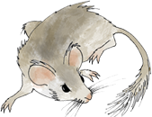
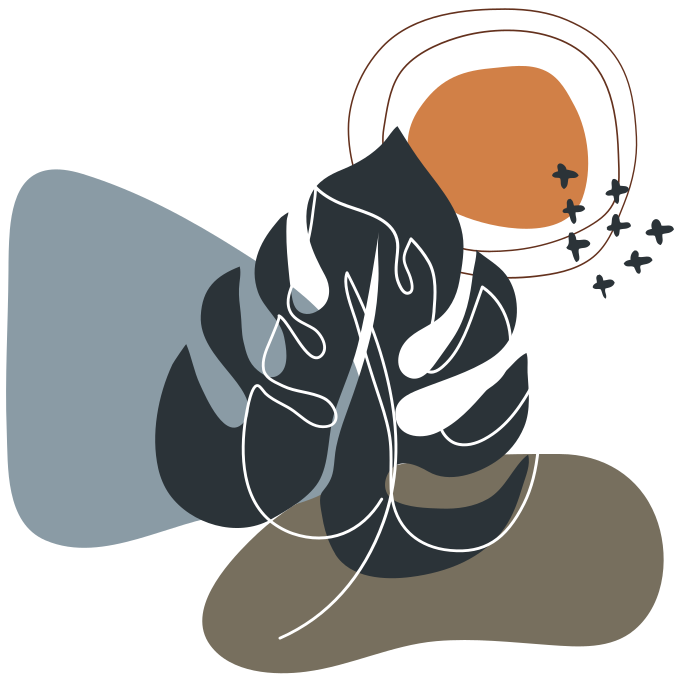
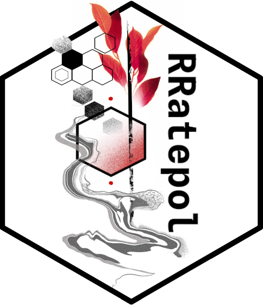
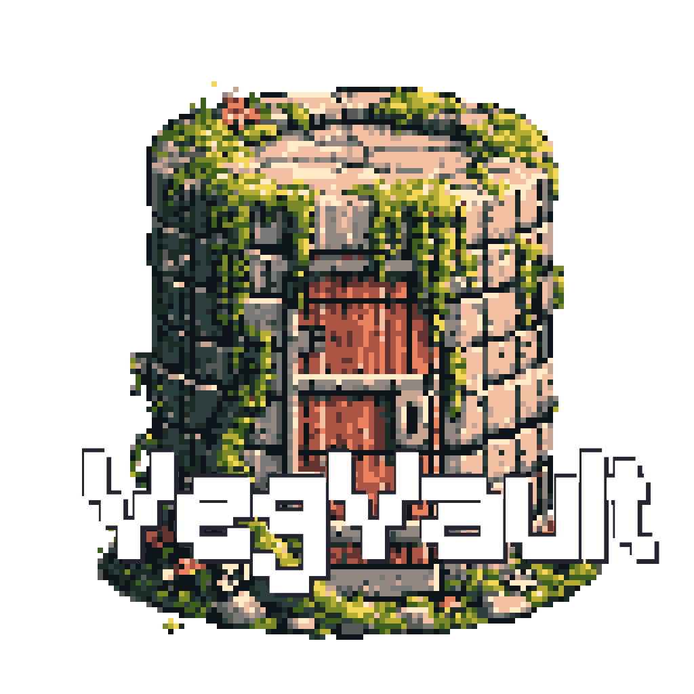

```{r}
#| label: setup
#| include: false
options(htmltools.dir.version = FALSE)
knitr::opts_chunk$set(
  fig.align = "center",
  out.width = "100%",
  dpi = 300,
  fig.align = "center"
)

if (!require("here")) install.packages("here")
library(here)
here::i_am("Presentation/presentation.qmd")

if (!require("renv")) install.packages("renv")
library(renv)
renv::restore(
  lockfile = here::here("renv.lock"),
  prompt = FALSE
)

if (!require("countdown")) install.packages("countdown")
library(countdown)


if (!require("jsonlite")) install.packages("jsonlite")
library(jsonlite)

if (!require("tidyverse")) install.packages("tidyverse")
library(tidyverse)

if (!require("qrcode")) install.packages("qrcode")
library(qrcode)

if (!require("cropcircles")) install.packages("cropcircles")
library(cropcircles)

include_local_figure <- function(data_source) {
  knitr::include_graphics(
    path = here::here(
      "Presentation",
      "Materials",
      data_source
    ),
    error = TRUE
  )
}


source(
  here::here("R/___setup_project___.R")
)

# Dynamic project name generation using {here}
project_name <- 
  basename(here::here())


# Create dynamic URLs
github_url <- 
  paste0(
    "https://github.com/OndrejMottl/",
     project_name
  )

slides_url <- 
  paste0(
    "https://ondrejmottl.github.io/", 
    project_name, "/"
  )
```

# {.bg-black}

<br>

:::: {.columns}

::: {.column width="70%"}
:::

::: {.column width="10%"}

```{r}
#| label: loqe-logo-title
include_local_figure("Logos/LoQE_logo_with_text_white_bg.png")
```

:::

::: {.column width="10%"}

```{r}
#| label: NATUC-logo-title
include_local_figure("Logos/PrFUK_strom_digital_bila.png")
```

:::

::: {.column width="10%"}

```{r}
#| label: UK-logo-title
include_local_figure("Logos/PR-56-version1-uk_slavnostni_eng_bila_hd.png")
```

:::


::::

<br>

:::: {.r-hstack}
::: {data-id="box1" style="background: `r colours['blue']`; width: 135px; height: 15px; margin: 0px;"}
:::

::: {data-id="box2" style="background: `r colours['white']`; width: 405px; height: 15px; margin: 0px;"}
:::

::: {data-id="box3" style="background: `r colours['pink']`; width: 135px; height: 15px; margin: 0px;"}
:::

::: {data-id="box4" style="background: `r colours['coral']`; width: 225px; height: 15px; margin: 0px;"}
:::

::: {data-id="box5" style="background: `r colours['orange']`; width: 135px; height: 15px; margin: 0px;"}
:::

::::

<br>

::: {.text-color-white .text-font-heading .text-size-heading3 .text-bold .text-center}
Estimating [Vegetation Change]{.text-highlight-blue .text-shadow-dark} from [Fossil Pollen]{.text-highlight-pink .text-shadow-dark} to [Planetary Boundaries]{.text-highlight-orange .text-shadow-light}
:::

::: {.text-color-white .text-font-heading .text-size-heading4 .text-center}
A Global, Long-Term Synthesis Using Big Data
:::

<br> 
<br> 

:::: {.columns}

::: {.column width="13%"}

```{r}
#| label: qr_presentation_title
qr_presentation <-
  qrcode::qr_code(
    slides_url,
    ecl = "H"
  )

qrcode::generate_svg(
  qrcode = qr_presentation,
  filename = here::here("Presentation/Materials/QR/qr_presentation.svg"),
  foreground = colours[["white"]],
  background = colours[["black"]],
  show = FALSE
)

include_local_figure("QR/qr_presentation.svg")
```
:::


::: {.column width="87%" .text-right .text-size-body .text-color-grey}
[👤](https://ondrejmottl.github.io/)Ondřej Mottl

[TIBS 2026]{.text-color-grey}
:::

::::


::: {.footer}
Scan the QR code to follow along!
:::

## {.bg-black}

:::: {.columns}

::: {.column width="50%"}

<br>
<br>

```{r}
#| label: earth image
include_local_figure("AI_generated/Earth.jpeg")
```

:::

::: {.column width="50%" .text-center .center-vertical}

6/9 [global]{.text-highlight-purple .text-shadow-dark} Earth [Planetary Boundaries]{.text-highlight-pink .text-shadow-dark} are already [exceeded]{.text-highlight-orange .text-shadow-light} 

::: {.text-smaller .text-color-grey}
(Richardson et al. [2023](https://doi.org/10.1126/sciadv.adh2458)) _Science Advances_
:::

:::

::::

::: {.footer}
Image generated by Bing
:::

## {background-image="../Presentation/Materials/Pexels/pexels-justus-menke-3490295-5214145.jpg" background-opacity="0.55" .text-center}

:::: {.columns}

::: {.column width="20%"}
:::

::: {.column width="60%"} 

::: {.r-fit-text .text-bold .text-color-blue .text-shadow-dark .text-underline}
~20%
:::

:::

::: {.column width="20%"}
:::

::::

::: {.blockquote}
Species to be exposed to [dangerous temperature]{.text-bold} condition (with global increase of 2.0°C) 

::: {.text-smaller .text-color-grey}
([IPCC AR6 Synthesis Report](https://www.ipcc.ch/report/ar6/syr/downloads/report/IPCC_AR6_SYR_SPM.pdf))
:::

:::

::: {.footer}
[Image by Justus Menke from Pexels]{.text-color-black}
:::

## What if … {.text-center}

:::: {.columns}

::: {.column width="50%"}
<br>
[🤔]{.r-fit-text}
:::

::: {.column width="50%" .text-center .text-larger .text-bold}

<br>
<br>


… we inform the [conservation]{.text-highlight-blue .text-shadow-dark} policies by incorporating a [global, long-term]{.text-highlight-purple .text-shadow-dark} synthesis on [ecosystem dynamics]{.text-highlight-pink .text-shadow-dark} using [paleoecological]{.text-highlight-coral .text-shadow-dark} [Big Data]{.text-highlight-orange .text-shadow-light}?
:::

::::

## 🙋[Hi!]{.text-highlight-blue .text-shadow-dark} I am [Ondřej Mottl]{.text-highlight-orange .text-shadow-light}

<br>

:::: {.columns}

::: {.column width="35%"}

```{r}
#| label: personal sticker
include_local_figure("About/head_photo.png")
```


:::

::: {.column width="1%"}

:::

::: {.column width="64%" .text-center}

Assistant Professor at 🏛️[Charles University](https://cuni.cz/UK-1.html), Prague, 🇨🇿

<br>

Interested in [macroecology]{.text-highlight-purple .text-shadow-dark}, [palaeoecology]{.text-highlight-pink .text-shadow-dark}, [biodiversity]{.text-highlight-coral .text-shadow-dark}, and [data science]{.text-highlight-orange .text-shadow-light}

<br>

Head of the 🧑‍💻[Laboratory of Quantitative Ecology](https://ondrejmottl.github.io/lab/about_the_lab.html)

:::

::::

:::: {.columns}

::: {.column width="5%"}
:::

::: {.column width="45%" .text-smaller}

* 📧 ondrej.mottl(at)natur.cuni.cz
* 🦋 [ondrejmottl.bsky.social](https://bsky.app/profile/ondrejmottl.bsky.social)
* 🐱 [Github](https://github.com/OndrejMottl)
* 🆔 [ORCID](https://orcid.org/0000-0002-9796-5081)
* 🌐 [Personal webpage](https://ondrejmottl.github.io/)
:::

::: {.column width="9%"}
:::


::: {.column width="20%"}

```{r}
#| label: loqe-logo-about_me
include_local_figure("Logos/LoQE_logo_with_text_white_bg.png")
```

:::

::: {.column width="21%"}
:::

::::

```{r}
#| label: QR code https://bit.ly/ondrej_mottl 
qr_personal_web <-
  qrcode::qr_code(
    "https://bit.ly/ondrej_mottl",
    ecl = "H"
  )

qrcode::generate_svg(
  qrcode = qr_personal_web,
  filename = here::here("Presentation/Materials/QR/qr_personal_web.svg"),
  foreground = colours[["black"]],
  background = colours[["white"]],
  show = FALSE
)
```

{.absolute top=0 right=0 width="120" height="120"}

# Palaeoecology

<br>

:::: {.columns}


::: {.column width="39%"}

```{r}
#| label: fordham_2020_a
include_local_figure("Fordham/369_abc5654_fa.jpeg")
```

:::

::: {.column width="1%"}
:::


::: {.column width="60%"}

```{r}
#| label: rordham_2020_printscreen
include_local_figure("Printscreens/fordham_2020.png")
```

::: {.blockquote .text-smaller}
Because [warning signals]{.text-highlight-blue .text-shadow-dark} … are commonly identified by using time-series … data, [paleo-archives]{.text-highlight-pink .text-shadow-dark} provide opportunities to [test conservation criteria]{.text-highlight-coral .text-shadow-dark} …
:::

:::

::::

```{r}
#| label: QR code fordham 2020 
qr_fordham <-
  qrcode::qr_code(
    "https://doi.org/10.1126/science.abc5654",
    ecl = "H"
  )

qrcode::generate_svg(
  qrcode = qr_fordham,
  filename = here::here("Presentation/Materials/QR/qr_fordham.svg"),
  foreground = colours[["black"]],
  background = colours[["white"]],
  show = FALSE
)
```

{.absolute top=0 right=0 width="120" height="120"}


::: {.footer}
Fordham et al. ([2020](https://doi.org/10.1126/science.abc5654)) _Science_
:::

## 

<br>
<br>

:::: {.columns}

::: {.column width = "50%" .text-size-heading3 .text-italic .text-center .text-font-heading}

<br>
<br>
<br>

[Fossil pollen]{.text-highlight-purple .text-bold .text-shadow-dark} as a window to the past [vegetation]{.text-highlight-orange .text-shadow-light} patterns
:::

::: {.column width = "50%"}

```{r}
#| label: palaeoecology
include_local_figure("Ai_generated/fossilpollen.jpeg")
```
:::

::::

::: {.footer}
Image created by Bing 
:::


## Neotoma Paleoecology Database {.text-center background-image="../Presentation/Materials/R_generated/Fossil_pollen/Neotoma_spatial_data_full-2025-12-09.png" background-size="1500px" background-repeat="no-repeat" background-opacity="0.65"}

{.absolute top=600 left=0 width="100" height="100"}
{.absolute top=600 right=0 width="100" height="100"}

<br>

:::: {.columns}

::: {.column width = "15%"}
:::

::: {.column width = "70%"}

::: {.text-bold .r-fit-text .text-color-black}
\>6650
:::

::: {.blockquote}
fossil pollen timeseries (records)
:::

:::

::: {.column width = "15%"}
:::

::::

::: {.footer}
Fossil pollen datasets accessed from [Neotoma](https://www.neotomadb.org/) on 2025-12-09
:::


## Palaeoecological dataset compilation

<br>
<br>

:::: {.columns}

::: {.column width = "70%"}

```{r}
#| label: compilation_full
include_local_figure("FOSSILPOL/Visualisation-compilation/compilation_full.png")
```
:::

::: {.column width = "30%"}

<br>


- Macro-scale data analysis
- Project specific
- Data quality control and reproducibility

:::

::::

::: {.footer}
Adjusted from Flantua & Mottl et al. ([2023](https://doi.org/10.1111/geb.13693)) _Global Ecology and Biogeography_
:::

## {.bg-black .text-color-white}

:::: {.columns}

::: {.column width = "45%"}

<br>


```{r}
#| label: fossilpol_logo_2
include_local_figure("Logos/FOSSILPOL_logo_600ppi.png")
```

:::

::: {.column width = "55%" .center-vertical .text-larger .text-center .text-bold}
The workflow to process [global]{.text-highlight-blue .text-shadow-dark} palaeoecological data of [fossil pollen]{.text-highlight-purple .text-shadow-dark} for [vegetation]{.text-highlight-pink .text-shadow-dark}-based [macroecological]{.text-highlight-coral .text-shadow-dark} [synthesis]{.text-highlight-orange .text-shadow-light}
:::

::::

::: {.footer}
Flantua & Mottl et al. ([2023](https://doi.org/10.1111/geb.13693)) _Global Ecology and Biogeography_
:::

## [FOSSILPOL workflow]{.text-color-white .text-shadow-dark} {background-image="../Presentation/Materials/FOSSILPOL/Banners/Banner_5.png" background-size="100% 20%" background-position="top left" background-repeat="no-repeat"}


```{r}
#| label: QR code https://bit.ly/FOSSILPOL coral
qr_fossilpol <-
  qrcode::qr_code(
    "https://bit.ly/FOSSILPOL",
    ecl = "H"
  )

qrcode::generate_svg(
  qrcode = qr_fossilpol,
  filename = here::here("Presentation/Materials/QR/qr_fossilpol_coral.svg"),
  foreground = colours[["white"]],
  background = colours[["coral"]],
  show = FALSE
)
```

{.absolute top=0 right=0 width="100" height="100"}

<br>

```{r}
#| label: workflow_full
#| out.height: 100%
#| out.width: NULL
include_local_figure("FOSSILPOL/Visualisation-workflow/workflow_full.png")
```

::: {.footer}
Flantua & Mottl et al. ([2023](https://doi.org/10.1111/geb.13693)) _Global Ecology and Biogeography_
:::

## Documentation (website)

<br>
<br>

:::: {.columns}

::: {.column width="35%"}

```{r}
#| label: website_preview
include_local_figure("Printscreens/website_preview.png")
```


```{r}
#| label: QR code https://bit.ly/FOSSILPOL bw
qrcode::generate_svg(
  qrcode = qr_fossilpol,
  filename = here::here("Presentation/Materials/QR/qr_fossilpol.svg"),
  foreground = colours[["black"]],
  background = colours[["white"]],
  show = FALSE
)
```

{.absolute top=0 right=0 width="120" height="120"}

:::

::: {.column width="5%"}
:::

::: {.column width="60%" .text-center}

```{r}
#| label: website_doc_preview
include_local_figure("Printscreens/website_doc_preview.png")
```

:::

::::

:::{.text-center}
Now bilingual! ([English]{.text-highlight-purple .text-shadow-dark}/[Spanish]{.text-highlight-pink .text-shadow-dark})

[Check it out!]{.text-highlight-orange .text-bold .text-shadow-light} - [bit.ly/FOSSILPOL](https://bit.ly/FOSSILPOL)
:::

::: {.footer}
Flantua & Mottl et al. ([2023](https://doi.org/10.1111/geb.13693)) _Global Ecology and Biogeography_
:::

## FOSSILPOL

{.absolute top=0 right=0 width="120" height="120"}

:::: {.columns}

::: {.column width="80%"}

<br>

- Open-source and [reproducible workflow]{.text-highlight-blue .text-shadow-dark} written in [R]{.text-highlight-purple .text-shadow-dark}
- Handles all the steps and [flags places]{.text-highlight-pink .text-shadow-dark}, where the user needs to [specify their choices]{.text-highlight-coral .text-shadow-dark}
- Modular structure to allow [flexibility]{.text-highlight-orange .text-shadow-light} and [customisation]{.text-highlight-green .text-shadow-dark} for different projects

:::

::: {.column width="20%"}

<br> 

```{r}
#| label: fossilpol_logo_3
include_local_figure("Logos/FOSSILPOL_logo_600ppi.png")
```

:::

::::

<br>

:::: {.columns}

::: {.column width="5%"}
:::

::: {.column width="50%" }

```{r}
#| label: flantua_2023_printscreen
include_local_figure("Printscreens/Flantua_2023.png")
```
[](https://doi.org/10.1111/geb.13693)
:::

::: {.column width="5%"}
:::

::: {.column width="35%" .fragment}

```{r}
#| label: gep_certificate
include_local_figure("Printscreens/GEB_certifiate.png")
```

:::

::: {.column width="5%"}
:::

::::

# {background-image="../Presentation/Materials/Pexels/pexels-jplenio-1136465.jpg" background-opacity="1" .text-center}

<br>
<br>
<br>
<br>
<br>
<br>
<br>
<br>
<br>
<br>
<br>

::: {.text-size-heading1 .text-center .text-font-heading .text-shadow-light .text-color-orange}
Inovations
:::

::: {.footer}
Image by Johannes Plenio from Pexels
:::


## The power of a personal computer {.text-center}

<br>

```{r}
#| label: computational_infrastructure
include_local_figure("R_generated/Computers/PC_power_in_time.png")
```

::: {.footer}
The data obtained from [wikipedia/Instructions_per_second](https://en.wikipedia.org/wiki/Instructions_per_second)
:::

## Analytical palaeoecology {.text-center}

<br>

:::: {.columns}

::: {.column width="5%"}
:::

::: {.column width="55%"}

```{r}
#| label: Dillon_2023_prin
include_local_figure("Printscreens/Dillon_2023.png")
```

:::

::: {.column width="40%"}
:::

::::

### Advancements

:::{.text-smaller}
Best practices and [reproducible workflows]{.text-highlight-blue .text-shadow-dark} for data standardization, Analyses that can accomodate [heterogeneous datasets]{.text-highlight-purple .text-shadow-dark}, Incentive structures that reward [software development]{.text-highlight-pink .text-shadow-dark}, Awareness of sampling context and biases, Best practices and conceptual frameworks to guide data integration, Development of taxon-free metrics, [Training]{.text-highlight-coral .text-shadow-dark} in quantitative methods and [Data Science]{.text-highlight-orange .text-shadow-light}, Collaboration with data scientists, [Interdisciplinary]{.text-highlight-green .text-shadow-dark} communication, collaboration, and funding
:::

<br>

::: {.fragment .text-center}
[Erin Dillon]{.text-highlight-black} has talk direcly after me!
:::

```{r}
#| label: QR code Dillon 2023
qr_dillon_2023 <-
  qrcode::qr_code(
    "https://doi.org/10.1017/pab.2023.3",
    ecl = "H"
  )
qrcode::generate_svg(
  qrcode = qr_dillon_2023,
  filename = here::here("Presentation/Materials/QR/qr_dillon_2023.svg"),
  foreground = colours[["black"]],
  background = colours[["white"]],
  show = FALSE
)
```

{.absolute top=150 right=150 width="150" height="150"}

::: {.footer}
Dillon et al. ([2023](https://doi.org/10.1017/pab.2023.3)) _Paleobiology_
:::

## Statistical advancements

<br>

New methods accounting for [effort]{.text-highlight-blue .text-shadow-dark}, [bias]{.text-highlight-purple .text-shadow-dark}, and [uncertainty]{.text-highlight-pink .text-shadow-dark}

<br>

:::: {.columns}

::: {.column width="5%"}
:::

::: {.column width="50%" .fragment}

 - Hierarchical  regression models
 - Joined Species Distribution Models (jSDM)
 - Model-based ordinations
 - Copula methods
 - …

:::

::: {.column width="5%"}
:::

::: {.column width="28%"}

```{r}
#| label: stats visualisation
include_local_figure("Pexels/pexels-olly-3758105.jpg")
```
:::

::: {.column width="17%"}
:::

::::

::: {.fragment .text-center}
More details in a moment in talk by [Gavin Simpson]{.text-highlight-black} in this Symposium!
:::

::: {.footer}
Photo by [Andrea Piacquadio](https://www.pexels.com/photo/woman-draw-a-light-bulb-in-white-board-3758105/) from Pexels
:::

## Estimating Rate of Change (RoC)

:::: {.columns}

::: {.column width="50%"}

<br>


**[Issues]{.text-highlingt-black} with palaeoecological RoC estimation**

[- Age uncertainties]{.fragment fragment-index="1"}

[- Uneven temporal distribution of samples]{.fragment fragment-index="2"}

[- Taxonomic uncertainties]{.fragment fragment-index="3"}

<br>

::: {.fragment .text-center fragment-index="3"}
[😱😱😱]{.r-fit-text}
:::

:::

::: {.column width="50%"}

::: {.fragment fragment-index="1" .text-center}

[example data]{.text-bold .text-larger }

```{r}
#| label: roc_issues_a
include_local_figure("R_generated/RRatepol/example_data_age_uncertainty_ridges.png")
```
:::

::: {.fragment fragment-index="2"}
```{r}
#| label: roc_issues_b
include_local_figure("R_generated/RRatepol/example_data_samples_density.png")
```
:::

:::

::::

## {RRatepol}

<br>

:::: {.columns}

::: {.column width="30%"}

```{r}
#| label: RRatepol_logo
include_local_figure("Logos/RRatepol_logo.png")
```

```{r}
#| label: RRatepol_github_qr
qr_rratepol <-
  qrcode::qr_code(
    "https://hope-uib-bio.github.io/R-Ratepol-package/",
    ecl = "H"
  )

qrcode::generate_svg(
  qrcode = qr_rratepol,
  filename = here::here("Presentation/Materials/QR/qr_rratepol.svg"),
  foreground = colours[["black"]],
  background = colours[["white"]],
  show = FALSE
)
```

{.absolute bottom=0 left=75 width="150" height="150"}

:::

::: {.column width="5%"}
:::

::: {.column width="65%"}

<br>
<br>

An R package for estimating [rate of change]{.text-highlight-blue .text-shadow-dark} (RoC) from [multivariate]{.text-highlight-purple .text-shadow-dark} (community) data in [time series]{.text-highlight-pink .text-shadow-dark}

::: {.incremental}

- Handles [uneven time series]{.text-highlight-coral .text-shadow-dark}
- [Propagates uncertainty]{.text-highlight-orange .text-shadow-light} (age, taxonomic)
- Can work with [various data types]{.text-highlight-green .text-shadow-dark} (palaeoecological proxies)

:::

:::

::::

::: {.footer}
Mottl et al. ([2021](https://doi.org/10.1016/j.revpalbo.2021.104483)) _Review of Palaeobotany and Palynology_
:::

## {RRatepol}

<br>

:::: {.columns}

::: {.column width="20%"}

:::

::: {.column width="80%"}

```{r}
#| label: rratepol_example_simple_classical
include_local_figure("R_generated/RRatepol/simple_classical.png")
```

:::

::::

{.absolute top=120 left=60 width="150" height="180"}

{.absolute bottom=0 left=60 width="120" height="120"}

::: {.footer}
Mottl et al. ([2021](https://doi.org/10.1016/j.revpalbo.2021.104483)) _Review of Palaeobotany and Palynology_
:::

## {RRatepol}

<br>

:::: {.columns}

::: {.column width="20%"}
:::

::: {.column width="80%"}

```{r}
#| label: rratepol_example_simple_rratepol
include_local_figure("R_generated/RRatepol/simple_rratepol.png")
```

:::

::::

{.absolute top=120 left=60 width="150" height="180"}

{.absolute bottom=0 left=60 width="120" height="120"}

::: {.footer}
Mottl et al. ([2021](https://doi.org/10.1016/j.revpalbo.2021.104483)) _Review of Palaeobotany and Palynology_
:::


## {RRatepol}

<br>

:::: {.columns}

::: {.column width="20%"}
:::

::: {.column width="80%"}

```{r}
#| label: rratepol_example_simple_rratepol_highlight
include_local_figure("R_generated/RRatepol/simple_rratepol_highlight.png")
```

:::

::::

{.absolute top=120 left=60 width="150" height="180"}

{.absolute bottom=0 left=60 width="120" height="120"}

::: {.footer}
Mottl et al. ([2021](https://doi.org/10.1016/j.revpalbo.2021.104483)) _Review of Palaeobotany and Palynology_
:::

# Global rates of vegetation change over the past 18,000 years {.text-center}

:::: {.columns}

::: {.column width="5%"}
:::

::: {.column width="25%"}

```{r}
#| label: fossilpol_logo_global_roc
include_local_figure("Logos/FOSSILPOL_logo_600ppi.png")
```

:::

::: {.column width="10%"}
:::

::: {.column width="20%"} 
<br>
[➕]{.r-fit-text}
:::

::: {.column width="10%"}
:::


::: {.column width="25%"}

```{r}
#| label: RRatepol_logo_global_roc
include_local_figure("Logos/RRatepol_logo.png")
```

:::

::: {.column width="5%"}
:::

::::

:::: {.columns}

::: {.column width="40%"}
Global assebmly of fossil pollen record
:::

::: {.column width="20%"}
:::

::: {.column width="40%"}
Estimation of rate of vegetation change 
:::

::::

## Global rates of vegetation change

<br>

```{r}
#| label: global_roc_map
include_local_figure("R_generated/Global_RoC/Data_distribution.png")
```

::: {.text-center}
Over 1100 fossil pollen time series from all continents 

[(except Antarctica)]{.text-smaller}
:::

::: {.footer}
Adapted from Mottl & Flantua et al. ([2021](https://doi.org/10.1126/science.abg1685)) _Science_
:::

## Global rates of vegetation change

<br>

```{r}
#| label: global_roc_example_0
include_local_figure("R_generated/Global_RoC/p0_empty_plot.png")
```

::: {.footer}
Adapted from Mottl & Flantua et al. ([2021](https://doi.org/10.1126/science.abg1685)) _Science_
:::

## Global rates of vegetation change

<br>

```{r}
#| label: global_roc_example_1
include_local_figure("R_generated/Global_RoC/p1_data_points.png")
```

::: {.footer}
Adapted from Mottl & Flantua et al. ([2021](https://doi.org/10.1126/science.abg1685)) _Science_
:::

## Global rates of vegetation change

<br>

```{r}
#| label: global_roc_example_2
include_local_figure("R_generated/Global_RoC/p2_gam_fit_with_ci.png")
```

::: {.footer}
Adapted from Mottl & Flantua et al. ([2021](https://doi.org/10.1126/science.abg1685)) _Science_
:::

## Global rates of vegetation change

<br>

```{r}
#| label: global_roc_example_3
include_local_figure("R_generated/Global_RoC/p3_significant_changes.png")
```

::: {.footer}
Adapted from Mottl & Flantua et al. ([2021](https://doi.org/10.1126/science.abg1685)) _Science_
:::

##

<br>

```{r}
#| label: global_roc_printscreen
include_local_figure("Printscreens/global_roc.png")
```

[](https://doi.org/10.1126/science.abg1685)


```{r}
#| label: global_roc_qr
qr_global_roc <-
  qrcode::qr_code(
    "https://doi.org/10.1126/science.abg1685",
    ecl = "H"
  )
qrcode::generate_svg(
  qrcode = qr_global_roc,
  filename = here::here("Presentation/Materials/QR/qr_global_roc.svg"),
  foreground = colours[["black"]],
  background = colours[["white"]],
  show = FALSE
)
```

{.absolute top=0 right=0 width="120" height="120"}

::: {.footer}
Mottl & Flantua et al. ([2021](https://doi.org/10.1126/science.abg1685)) _Science_
:::

# Continental Patterns 

<br>

:::: {.columns}

::: {.column width="50%"}

We do not have to stop at single [ecosystem property]{.text-highlight-blue .text-shadow-dark} (e.g., RoC)

[Asia as a case study spanning [diverse climates]{.text-highlight-pink .text-shadow-dark} and vegetation types]{.fragment fragment-index="1"}

::: {.blockquote .text-center .text-italic .fragment fragment-index="2"}
Can we identify [consistent continental trend]{.text-highlight-orange .text-shadow-light} of vegetation change across Asia during the Holocene?
:::

:::

::: {.column width="50%" .fragment fragment-index="1" .text-center}

[Asia Case Study]{.text-larger .text-font-heading .text-bold}

```{r}
#| label: Asia_spatial_trends
include_local_figure("R_generated/Asia/Asia_spatial_trends.png")
```

:::

::::

::: {.footer}
Adapted from Bhatta et al. ([2023](https://doi.org/10.3389/fevo.2023.1115784)) _Frontiers in Ecology and Evolution_
:::

## 

:::: {.columns}

::: {.column width="5%"}
:::

::: {.column width="50%"}

```{r}
#| label: bhatta_2023_printscreen_1
include_local_figure("Printscreens/Bhatta_2023.png")
```

:::

::::

```{r}
#| label: Asia_temporal_trends_p1
include_local_figure("R_generated/Asia/temporal_p1_site_level.png")
```


```{r}
#| label: qr_asia_synthesis
qr_asia_synthesis <-
  qrcode::qr_code(
    "https://doi.org/10.3389/fevo.2023.1115784",
    ecl = "H"
  )
qrcode::generate_svg(
  qrcode = qr_asia_synthesis,
  filename = here::here("Presentation/Materials/QR/qr_asia_synthesis.svg"),
  foreground = colours[["black"]],
  background = colours[["white"]],
  show = FALSE
)
```

{.absolute top=0 right=0 width="150" height="150"}

::: {.footer}
Adapted from Bhatta et al. ([2023](https://doi.org/10.3389/fevo.2023.1115784)) _Frontiers in Ecology and Evolution_
:::

## 

:::: {.columns}

::: {.column width="5%"}
:::

::: {.column width="50%"}

```{r}
#| label: bhatta_2023_printscreen_2
include_local_figure("Printscreens/Bhatta_2023.png")
```

:::

::::

```{r}
#| label: Asia_temporal_trends_p2
include_local_figure("R_generated/Asia/temporal_p2_climate_zone_level.png")
```

{.absolute top=0 right=0 width="150" height="150"}

::: {.footer}
Adapted from Bhatta et al. ([2023](https://doi.org/10.3389/fevo.2023.1115784)) _Frontiers in Ecology and Evolution_
:::

## 

:::: {.columns}

::: {.column width="5%"}
:::

::: {.column width="50%"}

```{r}
#| label: bhatta_2023_printscreen_3
include_local_figure("Printscreens/Bhatta_2023.png")
```

:::

::::

```{r}
#| label: Asia_temporal_trends_p3
include_local_figure("R_generated/Asia/temporal_p3_continent_level.png")
```

{.absolute top=0 right=0 width="150" height="150"}

::: {.footer}
Adapted from Bhatta et al. ([2023](https://doi.org/10.3389/fevo.2023.1115784)) _Frontiers in Ecology and Evolution_
:::

##

:::: {.columns}

::: {.column width="5%"}
:::

::: {.column width="50%"}

```{r}
#| label: bhatta_2024_printscreen
include_local_figure("Printscreens/Bhatta_2024.png")
```

:::

::::

```{r}
#| label: qr_asia_phylogenetic
qr_asia_phylogenetic <-
  qrcode::qr_code(
    "https://doi.org/10.1038/s41598-024-67650-1",
    ecl = "H"
  )
qrcode::generate_svg(
  qrcode = qr_asia_phylogenetic,
  filename = here::here("Presentation/Materials/QR/qr_asia_phylogenetic.svg"),
  foreground = colours[["black"]],
  background = colours[["white"]],
  show = FALSE
)
```

{.absolute top=0 right=0 width="150" height="150"}

:::: {.columns}

::: {.column width="50%"}
```{r}
#| label: Asia_phylo_temporal
include_local_figure("R_generated/Phylogenetic/Temporal_trends.png")
```

:::

::: {.column width="50%" .fragment}

```{r}
#| label: Asia_phylo_latitudinal
include_local_figure("R_generated/Phylogenetic/Latitudinal_trends.png")
```
:::

::::

::: {.footer}
Adapted from Bhatta et al. ([2024](https://doi.org/10.1038/s41598-024-67650-1)) _scientific reports_ 
:::


## [Student intermezzo]{.text-color-white .text-shadow-dark} {.bg-coral .text-center .text-color-white}

<br>

:::: {.columns}

::: {.column width="58%"}

<br>
<br>

[Poster No. [2006]{.text-highlight-black}]{.text-size-heading3}

[A Comparative Analysis of Methodological Frameworks for Reconstructing Continental Diversity Trends of Vegetation]{.text-italic .text-larger .text-bold .text-shadow-dark}

:::

::: {.column width="2%"}
:::

::: {.column width="40%"}

```{r}
#| label: poster_bryan
include_local_figure("Posters/novio_tibs_poster_draft_v.3.0.1.png")
```
:::

::::

# Functional Traits

:::: {.columns}

::: {.column width="50%" .text-smaller}

<br>

- Taxonomic identity ≠ ecological function
- [Functional ecology]{.text-highlight-blue .text-shadow-dark} allow to [generalise]{.text-highlight-purple .text-shadow-dark} across taxa, regions, and time
- [Link]{.text-highlight-pink .text-shadow-dark} between [palaeoecological proxies]{.text-highlight-coral .text-shadow-dark} and functional [traits]{.text-highlight-orange .text-shadow-light} 

<br>

:::{.fragment fragment-index="1"}

```{r}
#| label: brown_2023_screenshot
include_local_figure("Printscreens/brown_2023.png")
```

:::

```{r}
#| label: qr_brown_2023
qr_brown <-
  qrcode::qr_code(
    "https://doi.org/10.1111/1365-2435.14415",
    ecl = "H"
  )

qrcode::generate_svg(
  qrcode = qr_brown,
  filename = here::here("Presentation/Materials/QR/qr_brown_2023.svg"),
  foreground = colours[["black"]],
  background = colours[["white"]],
  show = FALSE
)
```

:::

::: {.column width="5%"}
:::


::: {.column width="40%" .fragment fragment-index="1"} 

```{r}
#| label: fnc_traits_figure1
include_local_figure("Functional_traits/fec14415-fig-0001-m.jpg")
```

:::

::: {.column width="5%"}
:::

::::

{.absolute top=0 right=0 width="120" height="120"}

::: {.footer}
Figure 1 from Brown et al. ([2023](https://doi.org/10.1111/1365-2435.14415)) _Functional Ecology_
:::

## [Student intermezzo]{.text-color-white .text-shadow-dark} {.bg-coral .text-center .text-color-white}

<br>

:::: {.columns}

::: {.column width="58%"}

<br>
<br>

[Poster No. [2005]{.text-highlight-black}]{.text-size-heading3}

[Functional Vegetation Paleoecology: Mitigate the impact of climate change with data-driven insight from past vegetation]{.text-italic .text-larger .text-bold .text-shadow-dark}

:::

::: {.column width="4%"}
:::

::: {.column width="38%"}

```{r}
#| label: poster_naty
include_local_figure("Posters/poster_FVP_Aarhus.png")
```
:::

::::

## Traits in time

<br>

:::: {.columns}

::: {.column width="50%"}

```{r}
#| label: fnc_traits_veeken_figure4_a
include_local_figure("Functional_traits/ele14063-fig-0004-m_crop_a.jpg")
```
:::

::: {.column width="50%"}

<br>
<br>

```{r}
#| label: veeken_2022_printscreen
include_local_figure("Printscreens/veeken_2022.png")
```

:::

::::

```{r}
#| label: veeken_2022_qr
qr_veeken <-
  qrcode::qr_code(
    "https://doi.org/10.1111/ele.14063",
    ecl = "H"
  )

qrcode::generate_svg(
  qrcode = qr_veeken,
  filename = here::here("Presentation/Materials/QR/qr_veeken_2022.svg"),
  foreground = colours[["black"]],
  background = colours[["white"]],
  show = FALSE
)
```

::: {.text-center}
Example for subcontinental scale [integration of functional traits]{.text-highlight-blue .text-shadow-dark} with [fossil pollen]{.text-highlight-coral .text-shadow-dark} data
:::

{.absolute top=0 right=0 width="120" height="120"}

::: {.footer}
Figure 4 from Veeken et al. ([2022](https://doi.org/10.1111/ele.14063)) _Ecology Letters_
:::

# {background-image="../Presentation/Materials/Pexels/pexels-cookiecutter-19166565.jpg" background-opacity="0.6" .text-center}

<br>
<br>
<br>
<br>
<br>
<br>
<br>
<br>

::: {.r-fit-text .text-center .text-font-heading .text-shadow-light .text-color-black .text-bold}
Data Integration
:::

::: {.footer}
[Photo by [panumas nikhomkhai](https://www.pexels.com/photo/modern-building-in-austria-19166565/) from Pexels]{.text-color-black .text-background-grey}
:::

## Denmark example  

<br>

::: {.blockquote .text-center .text-italic .text-color-black}

How has vegetation in **Denmark** remain **functionally stable** under **climate** change from the **LGM to the present**

:::

<br>

:::: {.columns}

::: {.column width="50%" .fragment}

### 🎯Data Needs

  - [Fossil pollen]{.text-highlight-blue} and [contemporary vegetation]{.text-highlight-coral .text-shadow-dark} plots  
  - Functional [traits]{.text-highlight-orange .text-shadow-light} (e.g. height, SLA, seed mass)  
  - [Climate]{.text-highlight-green .text-shadow-dark} data (past and contemporary)

:::

::: {.column width="50%" .fragment}

### 🚧Obstacles

  - ❌Several data sources (formats, tools),
  - ❌Taxonomies mismatch across datasets
  - ❌Technically challenging (with limited reproducibility)

:::
::::


## [VegVault]{.bold .text-highlight-black .text-shadow-light} + [{vaultkeepr}]{.text-highlight-black .text-shadow-light}  

<br>

:::: {.columns}

::: {.column width="50%" }

::: {.blockquote .text-center .text-italic .text-color-black}

How has vegetation in **Denmark** remain **functionally stable** under **climate** change from the **LGM to the present**?

:::

<br>

With few lines of code, you can get the data you need to answer that!

:::

::: {.column width="1%" }
:::

::: {.column width="49%"}
```{r}
#| label: vegvault_example_6
#| eval: false
#| echo: true
#| include: true
#| code-line-numbers: "1-21"
data_denmark <-
  vaultkeepr::open_vault(
    path = "<path_to_VegVault>"
  ) |>
  vaultkeepr::get_datasets() |>
  vaultkeepr::select_dataset_by_geo(
    lat_lim = c(54.5, 58.0),
    long_lim = c(8.0, 13.0)
  ) |>
  vaultkeepr::get_samples() |>
  vaultkeepr::select_samples_by_age(
    age_lim = c(0, 20000) # 20,000 BP
  ) |>
  vaultkeepr::get_taxa(
    classify_to = "genus"
  ) |>
  vaultkeepr::get_abiotic_data() |>
  vaultkeepr::get_traits(
    classify_to = "genus"
  ) |>
  vaultkeepr::extract_data()
  
```  

:::

::::

{.absolute bottom=20 left=80 width="170" height="170"}

{.absolute bottom=40 left=280 width="100" height="120"}

```{r}
#| label: vegvault_qr_code
qr_vegvault <-
  qrcode::qr_code(
    "https://bit.ly/VegVault",
    ecl = "H"
  )

qrcode::generate_svg(
  qrcode = qr_vegvault,
  file = here::here("Presentation/Materials/QR/qr_vegvault.svg"),
  foreground = colours[["black"]],
  background = colours[["white"]]
)
```

{.absolute top=0 right=0 width="120" height="120"}

::: {.footer}
Mottl et al. ([2025](https://doi.org/10.1038/s41597-025-06176-1)) _Scientific Data_
:::

## [VegVault]{.bold .text-highlight-black .text-shadow-light} database

<br>

:::: {.columns}

::: {.column width="45%"}

<br>
<br>
<br>
<br>
<br>
<br>
<br>

```{r}
#| label: mottl_2025_printscreen
include_local_figure("Printscreens/mottl_2025.png")
```

{.absolute top=90 left=80 width="350" height="350"}

:::

::: {.column width="5%"}
:::

::: {.column width="50%"}

* A global SQLite database linking [interdisciplinary plot-based]{.text-highlight-purple .text-shadow-dark} vegetation data! 
* Links to functional [traits]{.text-highlight-orange .text-shadow-light}, [climate]{.text-highlight-green .text-shadow-dark} variables, and soil properties 
* Built for exploring **biodiversity** dynamics across [time & space]{.text-bold}
* Open Source & [Reproducible]{.text-highlight-pink .text-shadow-dark} 
* 🔗Learn more: [bit.ly/VegVault](https://bit.ly/VegVault)

:::

::::

{.absolute top=0 right=0 width="120" height="120"}


::: {.footer}
Mottl et al. ([2025](https://doi.org/10.1038/s41597-025-06176-1)) _Scientific Data_
:::

## [VegVault]{.bold .text-highlight-black .text-shadow-light} database

:::: {.columns}

::: {.column width="90%"}
~110 GB | 32 tables & 87 variables | 480,000+ Datasets | 13M+ Samples  | 110,000+ Taxa | 11M+ Trait values | 8 Abiotic variables

:::

::: {.column width="10%"}
:::

::::

:::: {.columns .fragment}

::: {.column width="45%"}

#### Data sources 

- 🌿 [Paleoecological records]{.text-highlight-blue .text-shadow-dark} ([Neotoma]{.text-italic}, [FOSSILPOL]{.text-italic})
- 🌱 [Contemporary vegetation]{.text-highlight-coral .text-shadow-dark} ([sPlotOpen]{.text-italic}, [BIEN]{.text-italic})
- 🌾 [Functional traits]{.text-highlight-orange .text-shadow-light} ([BIEN]{.text-italic}, [TRY]{.text-italic})
- 🌍 [Climate & soil data]{.text-highlight-green .text-shadow-dark} ([CHELSA]{.text-italic}, [WoSIS]{.text-italic})  
:::

::: {.column width="55%"}

```{r}
#| label: Scheme
include_local_figure("VegVault/assembly_viz_04_colour_edit.svg")
```
:::

::::

{.absolute top=0 right=0 width="120" height="120"}

::: {.footer}
Mottl et al. ([2025](https://doi.org/10.1038/s41597-025-06176-1)) _Scientific Data_
:::

## [{vaultkeepr}]{.text-highlight-black .text-shadow-light} package

<br>

An Open Source R package📦 - Your key🔑 to [VegVault]{.bold .text-font-heading .text-highlight-black .text-shadow-light}

:::: {.columns}

::: {.column width="5%"}
:::

::: {.column width="30%"}

```{r}
#| label: vaultkeepr logo
include_local_figure("Logos/vaultkeepr_logo.png")
```
 
[](https://github.com/OndrejMottl/vaultkeepr/actions/workflows/R-CMD-check.yaml) 
[](https://app.codecov.io/gh/OndrejMottl/vaultkeepr?branch=main)
[](https://CRAN.R-project.org/package=vaultkeepr)

:::

::: {.column width="5%"}
:::

::: {.column width="55%"}

<br>

- ✅ No SQL required - just load & go!
- ✅ Filter by taxa, traits, time & space
- ✅ Tidyverse-compatible interface  
- ✅ Directly usable in R for analysis
- 🔗 Learn more: [bit.ly/vaultkeepr](https://bit.ly/vaultkeepr)

:::

::::

```{r}
#| label: vaultkeepr_qr_code
qr_vaultkeepr <-
  qrcode::qr_code(
    "https://bit.ly/vaultkeepr",
    ecl = "H"
  )

qrcode::generate_svg(
  qrcode = qr_vaultkeepr,
  file = here::here("Presentation/Materials/QR/qr_vaultkeepr.svg"),
  foreground = colours[["black"]],
  background = colours[["white"]]
)
```

{.absolute top=0 right=0 width="120" height="120"}

::: {.footer}
Mottl et al. ([2025](https://doi.org/10.1038/s41597-025-06176-1)) _Scientific Data_
:::

## [VegVault]{.bold .text-highlight-black .text-shadow-light} database

:::::: {.columns}

::::: {.column width="50%"}

<br>

#### 💎Key Innovations 

- Integration of [interdisciplinary vegetation data]{.text-highlight-purple .text-shadow-dark} into a single database
- Linking vegetation data with [functional traits]{.text-highlight-orange .text-shadow-light} and [abiotic variables]{.text-highlight-green .text-shadow-dark}
- User-friendly R package [{vaultkeepr}]{.text-highlight-black .text-shadow-light} for data access and extraction
- Open Source & [Reproducible]{.text-highlight-pink .text-shadow-dark} workflows for vegetation research

:::::

::::: {.column width="50%" .fragment}

:::: {.columns}

::: {.column width="45%"}

```{r}
#| label: vegvault_denmark_spatial
include_local_figure("R_generated/VegVault/plot_spatial.png")
```

:::

::: {.column width="1%"}
:::

::: {.column width="45%"}
```{r}
#| label: vegvault_denmark_temporal
include_local_figure("R_generated/VegVault/plot_temporal.png")
```

:::

::::

:::: {.columns}

::: {.column width="75%"}

```{r}
#| label: vegvault_denmark_mat_time
include_local_figure("R_generated/VegVault/plot_mat_time.png")
```

:::

::: {.column width="1%"}
:::

::: {.column width="20%"}

```{r}
#| label: vegvault_denmark_traits
include_local_figure("R_generated/VegVault/plot_traits.png")
```

:::

::::

:::::

::::::


{.absolute top=0 right=0 width="120" height="120"}

::: {.footer}
Mottl et al. ([2025](https://doi.org/10.1038/s41597-025-06176-1)) _Scientific Data_
:::


# {background-image="../Presentation/Materials/Pexels/pexels-markusspiske-2990650.jpg" background-opacity="0.8" .text-center}

::: {.r-fit-text .text-center .text-font-heading .text-shadow-dark .text-color-pink .text-bold}
Planetary Boundaries
:::

::: {.footer}
[Photo by [Markus Spiske](https://www.pexels.com/photo/climate-road-landscape-people-2990650/) from Pexels]{.text-color-black}
:::


## Planetary Boundaries

<br>

:::: {.columns}

::: {.column width="50%"}

```{r}
#| label: planetary_boundaries_figure
include_local_figure("Planetary_Boundaries/sciadv.adh2458-f1.jpg")
```

:::

::: {.column width="50%"}

<br>
<br>
<br>

```{r}
#| label: richardson_2023_printscreen
include_local_figure("Printscreens/Richardson_2023.png")
```

:::

::::

```{r}
#| label: richardson_2023_qr
qr_richardson <-
  qrcode::qr_code(
    "https://doi.org/10.1126/sciadv.adh2458",
    ecl = "H"
  )
qrcode::generate_svg(
  qrcode = qr_richardson,
  filename = here::here("Presentation/Materials/QR/qr_richardson_2023.svg"),
  foreground = colours[["black"]],
  background = colours[["white"]],
  show = FALSE
)
```

{.absolute top=0 right=0 width="120" height="120"}


::: {.footer}
Richardson et al. ([2023](https://doi.org/10.1126/sciadv.adh2458)) _Science Advances_
:::

## From Paleo to Policy

<br>

:::: {.columns}

::: {.column width="50%"}

<br>
<br>
<br>

```{r}
#| label: gillson_2025_printscreen
include_local_figure("Printscreens/Gillson_2025.png")
```

:::

::: {.column width="50%"}
- Paleoecology offers [long-term baselines]{.text-highlight-purple .text-shadow-dark} for historical [ranges of variability]{.text-highlight-purple .text-shadow-dark}
- [RAD]{.text-highlight-pink .text-shadow-dark} [(resist/accept/direct)]{.text-smaller} framework for integrating [paleoecological data]{.text-highlight-coral .text-shadow-dark} into [policy and decision-making]{.text-highlight-pink .text-shadow-dark}
- Even if the past is an [imperfect analogue]{.text-highlight-orange .text-shadow-light}, it is still essential for bounding [plausible variability]{.text-highlight-green .text-shadow-dark} and [diagnosing novelty]{.text-highlight-green .text-shadow-dark}.
:::

::::

```{r}
#| label: gillson_2025_qr
qr_gillson <-
  qrcode::qr_code(
    "https://doi.org/10.1111/gcb.70017",
    ecl = "H"
  )

qrcode::generate_svg(
  qrcode = qr_gillson,
  filename = here::here("Presentation/Materials/QR/qr_gillson_2025.svg"),
  foreground = colours[["black"]],
  background = colours[["white"]],
  show = FALSE
)
```

{.absolute top=0 right=0 width="120" height="120"}

::: {.footer}
Gillson et al. ([2025](https://doi.org/10.1111/gcb.70017)) _Global Change Biology_
:::


## From Paleo to Policy

<br>

```{r}
#| label: planetary_boundaries_diagram_1
include_local_figure("R_generated/Planetary_Boundaries/planetary_boundaries_diagram_1.png")
```

{.absolute top=0 right=0 width="120" height="120"}

::: {.footer}
Gillson et al. ([2025](https://doi.org/10.1111/gcb.70017)) _Global Change Biology_
:::

## From Paleo to Policy

<br>

```{r}
#| label: planetary_boundaries_diagram_2
include_local_figure("R_generated/Planetary_Boundaries/planetary_boundaries_diagram_2.png")
```

{.absolute top=0 right=0 width="120" height="120"}

::: {.footer}
Gillson et al. ([2025](https://doi.org/10.1111/gcb.70017)) _Global Change Biology_
:::

## [The time is ripe … 👍]{.text-shadow-dark} {.bg-black .text-color-white}

<br>

:::: {.columns}

::: {.column width="70%" .incremental}

- [Global]{.text-highlight-blue .text-shadow-dark} (integrated) ecological [databases]{.text-highlight-blue .text-shadow-dark} spanning large spatio-temporal scales
- [Reproducible workflows]{.text-highlight-purple .text-shadow-dark} for data access 
- Ways to study various [facets of biodiversity]{.text-highlight-pink .text-shadow-dark} [(taxonomic, functional, phylogenetic)]{.text-smaller}
- Statistical [methods]{.text-highlight-coral .text-shadow-dark} to handle [complex hierarchical data]{.text-highlight-coral .text-shadow-dark} structures
- Computational [power]{.text-highlight-orange .text-shadow-light} and Open Source [tools]{.text-highlight-orange .text-shadow-light} for [uncertainty-incorporating]{.text-highlight-orange .text-shadow-light} analysis

:::

::: {.column width="30%"}

```{r}
#| label: pexels_clock
include_local_figure("Pexels/pexels-felix-mittermeier-355915.jpg")
```

:::

::::

::: {.footer}
Photo by [Felix Mittermeier](https://www.pexels.com/photo/round-black-wooden-analog-table-clock-on-black-surface-355915/) from Pexels
:::

## {background-image="../Presentation/Materials/Pexels/pexels-tudor-sorin-2003800090-29004768.jpg" background-opacity="0.7" .text-center}

:::: {.columns}

::: {.column width="10%"}
:::

::: {.column width="80%"}

::: {.blockquote .text-center .text-bold .text-larger}

Paleoecological data is ready to inform  biodiversity-conservation and rewilding actions!
:::

:::

::: {.column width="10%"}
:::

::::

::: {.footer}
[Photo by [Tudor Sorin](https://www.pexels.com/photo/majestic-european-bison-in-romanian-wilderness-29004768/) from Pexels]{.text-color-black}
:::

# [This presentation]{.text-shadow-dark} {.bg-grey .text-center .text-color-black}

<br>

[is publically available!]{.text-size-heading3}

<br>

:::{.text-larger}
🐱[Code](`r github_url`) | 🖼️[Slides](`r slides_url`)
:::

<br>

:::: {.columns}

::: {.column width="35%"}
:::

::: {.column width="30%"}
```{r}
#| label: presentation_qr_grey
qrcode::generate_svg(
  qrcode = qr_presentation,
  filename = here::here("Presentation/Materials/QR/qr_presentation_grey.svg"),
  foreground = colours[["black"]],
  background = colours[["grey"]],
  show = FALSE
)

include_local_figure("QR/qr_presentation_grey.svg")
```

:::

::: {.column width="35%"}
:::

::::

# {.bg-black}

<br>

::: {.text-color-white .text-font-heading .text-larger .text-bold .text-center}
Estimating [Vegetation Change]{.text-highlight-blue .text-shadow-dark} from [Fossil Pollen]{.text-highlight-pink .text-shadow-dark} to [Planetary Boundaries]{.text-highlight-orange .text-shadow-light}
:::

::: {.text-color-white .text-font-heading .text-center .text-smaller}
A Global, Long-Term Synthesis Using Big Data
:::

:::: {.columns}

::: {.column width="25%"}

```{r}
#| label: Ondra
include_local_figure("About/head_photo.png")
```

:::

::: {.column width="45%" .text-smaller}

<br>

* 📧 ondrej.mottl(at)natur.cuni.cz
* 🦋 [ondrejmottl.bsky.social](https://bsky.app/profile/ondrejmottl.bsky.social)
* 🐱 [Github](https://github.com/OndrejMottl)
* 🆔 [ORCID](https://orcid.org/0000-0002-9796-5081)
* 🌐 [Personal webpage](https://ondrejmottl.github.io/)

:::

::: {.column width="16%"}
:::

::: {.column width="13%"}

<br>
<br>

```{r}
#| label: QR code personal site 
qrcode::generate_svg(
  qrcode = qr_personal_web,
  filename = here::here("Presentation/Materials/QR/qr_personal_web_inverted.svg"),
  background = colours[["black"]],
  foreground = colours[["white"]],
  show = FALSE
)

include_local_figure("QR/qr_personal_web_inverted.svg")
```

:::

::::

:::: {.r-hstack}
::: {data-id="box1" style="background: `r colours['blue']`; width: 135px; height: 15px; margin: 0px;"}
:::

::: {data-id="box2" style="background: `r colours['white']`; width: 405px; height: 15px; margin: 0px;"}
:::

::: {data-id="box3" style="background: `r colours['pink']`; width: 135px; height: 15px; margin: 0px;"}
:::

::: {data-id="box4" style="background: `r colours['coral']`; width: 225px; height: 15px; margin: 0px;"}
:::

::: {data-id="box5" style="background: `r colours['orange']`; width: 135px; height: 15px; margin: 0px;"}
:::

::::

<br>

:::: {.columns}

::: {.column width="25%" .text-size-body .text-color-grey .text-center}
[👤](https://ondrejmottl.github.io/)Ondřej Mottl

[TIBS 2026]{.text-color-grey}
:::

::: {.column width="44%"}
:::

::: {.column width="10%"}

```{r}
#| label: loqe-logo-outro
include_local_figure("Logos/LoQE_logo_with_text_white_bg.png")
```

:::

::: {.column width="10%"}

```{r}
#| label: NATUC-logo-outro
include_local_figure("Logos/PrFUK_strom_digital_bila.png")
```

:::

::: {.column width="10%"}

```{r}
#| label: UK-logo-outro
include_local_figure("Logos/PR-56-version1-uk_slavnostni_eng_bila_hd.png")
```

:::

::::

::: {.footer}
My trip has been funded by Czech Science Foundation PIF grant (GN23-06386I)
:::